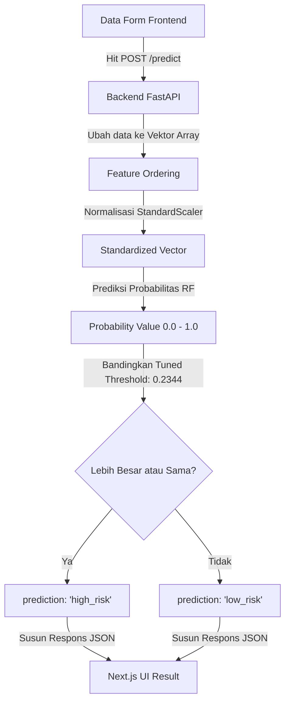

# Panduan Pengembangan & Integrasi Backend (FastAPI) & Machine Learning (ML)

Dokumen ini berisi panduan lengkap untuk membangun, menghubungkan, dan mendeploy **Backend FastAPI** yang mengintegrasikan model **Explainable Machine Learning** hasil seleksi fitur (24 fitur) dengan **Frontend Next.js** yang telah selesai dibuat.

---

## 📂 1. Struktur Folder Rekomendasi
Untuk kerapian proyek, buat folder `backend/` sejajar dengan folder `frontend/` pada root direktori:

```text
Dataset-NHANES/
├── BACKEND_ML.md                  # [BARU] Panduan Ini
├── backend/                       # [BARU] Direktori Kode Backend
│   ├── app/
│   │   ├── __init__.py
│   │   └── main.py                # Kode Utama FastAPI (Inference & XAI Logic)
│   └── requirements.txt           # Dependensi Python Backend
│
├── frontend/                      # [SUDAH ADA] Aplikasi Next.js
│   ├── src/
│   │   ├── app/
│   │   │   ├── quiz/page.tsx      # Tampilan Pengisian Kuis
│   │   │   └── result/page.tsx    # Tampilan Hasil Evaluasi & XAI
│   │   └── lib/
│   │       ├── api.ts             # Service untuk hit API ke Backend
│   │       └── quiz-config.ts     # Konfigurasi Pertanyaan (24 Fitur)
│
├── models/                        # [SUDAH ADA] Model & Scaler Hasil Training
│   └── feature_selection/
│       ├── rf_best_model.pkl      # Model Random Forest Terbaik (Skenario E)
│       └── scaler.pkl             # StandardScaler Object
│
├── data/                          # [SUDAH ADA] Dataset dan Grup Fitur
│   └── processed/
│       └── feature_selection/
│           └── feature_groups.pkl # Metadata Pengelompokan Fitur
│
└── docs/                          # [SUDAH ADA] Folder Dokumentasi Progres
```

---

## ⚙️ 2. Persiapan Dependensi Backend
Buat berkas [backend/requirements.txt](file:///home/fadhilr/Kuliah/Semester%204/AI/Dataset-NHANES/backend/requirements.txt) untuk memasang semua pustaka Python yang dibutuhkan:

```text
fastapi
uvicorn
joblib
numpy
pandas
scikit-learn
pydantic
```

Pasang semua library tersebut dengan menjalankan perintah berikut di terminal:
```bash
pip install -r backend/requirements.txt
```

---

## 🖥️ 3. Kode Backend FastAPI (`backend/app/main.py`)
Frontend Next.js Anda mengharapkan format data response tertentu untuk menampilkan diagram skor kesehatan, indikator tingkat risiko, penjelasan XAI, serta rekomendasi gaya hidup.

Berikut adalah kode backend lengkap dan terintegrasi di berkas [backend/app/main.py](file:///home/fadhilr/Kuliah/Semester%204/AI/Dataset-NHANES/backend/app/main.py) yang secara spesifik dirancang agar cocok dengan frontend Next.js Anda:

```python
import os
import joblib
import numpy as np
import pandas as pd
from pathlib import Path
from pydantic import BaseModel
from fastapi import FastAPI, HTTPException
from fastapi.middleware.cors import CORSMiddleware

app = FastAPI(
    title="NHANES Stroke Prediction & XAI API",
    description="API untuk memprediksi risiko stroke menggunakan Random Forest dengan Explainable AI (XAI) berbasis aturan klinis.",
    version="1.1.0"
)

# ─── MIDDLEWARE CORS (PENTING UNTUK NEXT.JS) ──────────────────────────────────
# Mengizinkan frontend Next.js mengakses API ini dari port localhost (misal: 3000) atau production domain
app.add_middleware(
    CORSMiddleware,
    allow_origins=["*"],  # Ganti dengan domain frontend saat deploy ke produksi
    allow_credentials=True,
    allow_methods=["*"],
    allow_headers=["*"],
)

# ─── LOADING MODEL & SCALER ARTIFACTS ─────────────────────────────────────────
# Menghitung path absolut secara relatif dari posisi berkas main.py
BASE_DIR = Path(__file__).resolve().parent.parent.parent
MODEL_PATH = BASE_DIR / 'models' / 'feature_selection' / 'rf_best_model.pkl'
SCALER_PATH = BASE_DIR / 'models' / 'feature_selection' / 'scaler.pkl'
FEATURE_GROUPS_PATH = BASE_DIR / 'data' / 'processed' / 'feature_selection' / 'feature_groups.pkl'

try:
    if not MODEL_PATH.exists() or not SCALER_PATH.exists():
        raise FileNotFoundError(f"Berkas model/scaler tidak ditemukan di: {MODEL_PATH} atau {SCALER_PATH}")
    
    model = joblib.load(MODEL_PATH)
    scaler = joblib.load(SCALER_PATH)
    feature_groups = joblib.load(FEATURE_GROUPS_PATH)
    
    # Ambil urutan fitur untuk mencegah kesalahan input kolom (misalignment)
    CLINICAL = feature_groups['CLINICAL']
    SLEEP = feature_groups['SLEEP']
    STRESS = feature_groups['STRESS']
    PHYSICAL = feature_groups['PHYSICAL']
    FEATURE_ORDER = CLINICAL + SLEEP + STRESS + PHYSICAL
    
    print("✓ Model, Scaler, dan Metadata Fitur berhasil dimuat!")
    print(f"✓ Jumlah fitur model: {len(FEATURE_ORDER)}")
except Exception as e:
    print(f"✗ Gagal memuat model: {e}")
    model, scaler, FEATURE_ORDER = None, None, []

# ─── SCHEMA INPUT (24 FITUR SELEKSI STATISTIK) ────────────────────────────────
class StrokeInput(BaseModel):
    # Fitur Klinis (12)
    age: float
    education: float
    income_ratio: float
    waist_circ: float
    systolic_bp: float
    diastolic_bp: float
    hypertension: float
    diabetes: float
    heart_failure: float
    coronary_disease: float
    heart_attack: float
    ever_smoked: float
    
    # Fitur Kualitas Tidur (4)
    snoring_freq: float
    sleep_apnea: float
    sleep_problem_doctor: float
    daytime_sleepy: float
    
    # Fitur Kesehatan Mental / Stres PHQ-9 (5)
    stress_anhedonia: float
    stress_depressed: float
    stress_fatigue: float
    stress_concentration: float
    stress_self_esteem: float
    
    # Fitur Aktivitas Fisik (3)
    vigorous_leisure: float
    vigorous_leisure_min: float
    moderate_leisure: float

# ─── ENDPOINT API ─────────────────────────────────────────────────────────────
@app.get("/")
def read_root():
    return {
        "status": "ready",
        "model_loaded": model is not None,
        "features_count": len(FEATURE_ORDER)
    }

@app.post("/predict")
def predict_stroke(data: StrokeInput):
    if not model or not scaler:
        raise HTTPException(
            status_code=500,
            detail="Model Machine Learning tidak siap di server."
        )
    
    try:
        # 1. Konversi Pydantic schema ke python dictionary
        input_dict = data.dict()
        
        # 2. Susun vektor input dengan urutan yang sama persis saat training
        input_vector = [input_dict[feat] for feat in FEATURE_ORDER]
        
        # 3. Standardisasi menggunakan StandardScaler
        input_scaled = scaler.transform([input_vector])
        
        # 4. Prediksi probabilitas (indeks 1 adalah kelas positif / stroke)
        proba = float(model.predict_proba(input_scaled)[0, 1])
        
        # 5. Klasifikasi dengan Tuned Threshold Random Forest Skenario E (0.2344)
        # Optimal threshold hasil Youden's J-Statistic untuk memaksimalkan Recall (Sensitivitas)
        threshold = 0.2344
        prediction_label = "high_risk" if proba >= threshold else "low_risk"
        
        # 6. Logika Explainable AI (XAI) Dinamis Berdasarkan Faktor Risiko Individu
        explanations = []
        
        # Penjelasan Demografi & Klinis
        if data.age >= 60:
            explanations.append(f"Faktor Usia: Usia Anda saat ini ({int(data.age)} tahun) merupakan salah satu faktor risiko alami stroke yang tidak dapat dimodifikasi.")
            
        if data.systolic_bp >= 130 or data.diastolic_bp >= 80:
            explanations.append(f"Tekanan Darah Tinggi: Tensi Anda ({int(data.systolic_bp)}/{int(data.diastolic_bp)} mmHg) berada di atas rentang normal. Hipertensi adalah pemicu utama kerusakan pembuluh darah otak.")
            
        if data.hypertension == 1:
            explanations.append("Dua Kali Lipat Risiko: Dosis obat atau riwayat medis hipertensi aktif secara langsung melipatgandakan beban elastisitas arteri.")
            
        if data.diabetes == 1:
            explanations.append("Komplikasi Gula Darah: Kadar glukosa berlebih pada diabetes mempercepat penyumbatan pembuluh darah (aterosklerosis).")
            
        if data.heart_failure == 1 or data.coronary_disease == 1 or data.heart_attack == 1:
            explanations.append("Riwayat Kardiovaskular: Riwayat masalah jantung (gagal jantung, koroner, atau serangan jantung) sangat berkorelasi dengan pembentukan bekuan darah pembawa stroke.")
            
        if data.ever_smoked == 1:
            explanations.append("Zat Kimia Rokok: Riwayat merokok merusak lapisan endotel pembuluh darah dan mempermudah pengendapan plak lemak.")
            
        # Penjelasan Masalah Tidur
        if data.sleep_apnea >= 3:
            explanations.append("Sleep Apnea: Keluhan henti napas saat tidur mengurangi saturasi oksigen ke otak secara berulang di malam hari.")
            
        if data.snoring_freq >= 3:
            explanations.append("Frekuensi Mendengkur Tinggi: Kebiasaan mendengkur sering dikaitkan dengan penyempitan jalan napas dan getaran pada pembuluh karotis leher.")
            
        if data.sleep_problem_doctor == 1:
            explanations.append("Gangguan Tidur Kronis: Riwayat konsultasi masalah tidur ke dokter mengindikasikan adanya gangguan tidur yang memengaruhi ritme sirkadian tubuh.")
            
        # Penjelasan Stres & PHQ-9
        stress_score = data.stress_anhedonia + data.stress_depressed + data.stress_fatigue + data.stress_concentration + data.stress_self_esteem
        if stress_score >= 8:
            explanations.append(f"Beban Stres & Mental: Akumulasi skor PHQ-5 Anda ({int(stress_score)}/15) menunjukkan beban emosional yang tinggi. Stres kronis memicu respons peradangan dan peningkatan denyut jantung.")
        elif data.stress_depressed >= 2 or data.stress_anhedonia >= 2:
            explanations.append("Gejala Depresi: Perasaan sedih atau hilangnya minat beraktivitas dapat menurunkan kebiasaan aktif hidup sehat dan mengganggu metabolisme tubuh.")
            
        # Penjelasan Aktivitas Fisik
        if data.vigorous_leisure == 0 and data.moderate_leisure == 0:
            explanations.append("Gaya Hidup Sedentary: Tidak adanya olahraga sedang/berat rutin dalam seminggu terakhir menurunkan efisiensi pompa jantung dan memperlambat aliran darah.")
        elif data.vigorous_leisure_min < 75 and data.vigorous_leisure == 1:
            explanations.append(f"Aktivitas Kurang Optimal: Durasi olahraga berat Anda ({int(data.vigorous_leisure_min)} menit/minggu) masih di bawah batas minimal anjuran kesehatan (75 menit/minggu).")
            
        # Fallback jika semua parameter di bawah ambang risiko
        if not explanations:
            explanations.append("Profil Kesehatan Optimal: Parameter fisik dan kebiasaan harian Anda sebagian besar berada pada rentang yang aman saat ini.")
            
        # 7. Pemilihan Rekomendasi Dinamis
        if prediction_label == "high_risk":
            recommendation = (
                "Segera jadwalkan konsultasi dengan dokter keluarga atau spesialis jantung/saraf untuk melakukan evaluasi medis komprehensif. "
                "Fokus pada pembatasan konsumsi garam (maksimal 1 sendok teh per hari), rutin cek tekanan darah secara mandiri, "
                "upayakan berjalan kaki cepat minimal 30 menit per hari, pertahankan jadwal tidur teratur, dan hindari paparan asap rokok."
            )
        else:
            recommendation = (
                "Bagus! Pertahankan kondisi kesehatan dan kebiasaan harian Anda saat ini. "
                "Disarankan untuk tetap aktif berolahraga dengan intensitas sedang minimal 150 menit dalam seminggu, "
                "mengkonsumsi makanan bergizi seimbang (kaya serat, sayur, buah, dan membatasi lemak jenuh), "
                "serta melakukan deteksi dini (medical check-up) berkala setidaknya sekali dalam setahun."
            )
            
        # 8. Return response sesuai kontrak Next.js (PredictResponse di frontend/src/lib/api.ts)
        return {
            "prediction": prediction_label,    # "high_risk" atau "low_risk"
            "probability": proba,              # Mengembalikan float antara 0.0 s.d 1.0 (Next.js mengalikan * 100)
            "explanation": explanations,        # Array of strings
            "recommendation": recommendation   # String tunggal rekomendasi
        }
        
    except Exception as e:
        raise HTTPException(
            status_code=400,
            detail=f"Gagal memproses data input: {str(e)}"
        )
```

> [!WARNING]
> **Penting untuk Probabilitas:** Jangan mengalikan `proba` dengan `100` di backend. Frontend Next.js Anda di [result/page.tsx](file:///home/fadhilr/Kuliah/Semester%204/AI/Dataset-NHANES/frontend/src/app/result/page.tsx) baris 80 melakukan penghitungan berikut:
> `const probability = Math.round(Math.max(0, Math.min(1, result.probability)) * 100);`
> Jika Anda mengirimkan nilai `25.0` (persen), frontend akan memproses `Math.min(1, 25.0)` yang menghasilkan `1`, lalu dikali `100` sehingga hasil yang tampil di gauge kuis selalu **100%**! Mengirimkan nilai decimal `0.25` (float) adalah cara yang tepat agar gauge terbaca **25%**.

---

## 🔬 4. Penyelarasan Alur Kerja Machine Learning (ML)
Model yang dijalankan di server API (`rf_best_model.pkl`) adalah model klasifikasi **Random Forest Classifier** yang dilatih pada **Skenario E** (Klinis + Semua Gaya Hidup). 

Alur pemrosesan data ML pada API berjalan sebagai berikut:



### Mengapa Threshold Diatur ke `0.2344`?
Pada dataset survei populasi non-klinis seperti NHANES, kasus stroke merupakan kejadian yang langka (*class imbalance*, hanya sekitar 3.6% dari responden). 
* Jika menggunakan threshold default (`0.50`), sensitivitas/Recall model Random Forest hanya berada di angka **`17.14%`** (melewatkan 82.86% pasien berisiko stroke).
* Melalui optimasi statistik **Youden's J-Statistic** pada kurva ROC, ambang batas probabilitas diturunkan ke nilai optimal **`0.2344`** ($23.44\%$). 
* Hal ini mendongkrak Recall model secara drastis menjadi **`77.14%`**, menjadikannya alat penapisan (*screening tool*) yang jauh lebih efektif dan aman bagi masyarakat umum.

---

## 🚀 5. Cara Menjalankan Lokal & Pengujian

### Langkah 5.1: Jalankan Server Lokal FastAPI
Buka terminal baru di root folder proyek, lalu masuk ke direktori `backend` dan jalankan command berikut:
```bash
# Jalankan uvicorn server
uvicorn backend.app.main:app --reload --port 8000
```
Server backend akan berjalan di [http://localhost:8000](http://localhost:8000).

### Langkah 5.2: Uji Melalui Swagger UI (Docs)
FastAPI secara otomatis menyediakan antarmuka pengujian interaktif. Buka browser dan arahkan ke:
* [http://localhost:8000/docs](http://localhost:8000/docs)
* Klik pada tombol **POST `/predict`** -> **Try it out** -> Isi JSON body -> Tekan **Execute** untuk melihat response dari model secara langsung.

### Langkah 5.3: Jalankan Frontend Next.js Anda
Buka terminal lain di folder `frontend/`, lalu jalankan Next.js dalam mode development:
```bash
npm run dev
```
Aplikasi Next.js akan berjalan di [http://localhost:3000](http://localhost:3000). Buka aplikasi tersebut di browser, isi kuis kuesioner, dan sistem akan langsung melakukan prediksi risiko serta menampilkan interpretasi Explainable AI secara dinamis!

---

## 🌐 6. Panduan Deployment Ke Server Publik

### Langkah 6.1: Deploy Backend ke Render / Railway (Python Environment)
1. Commit kode backend Anda ke GitHub.
2. Buat akun dan masuk ke [Render](https://render.com/).
3. Buat **New Web Service**, hubungkan dengan repositori GitHub Anda.
4. Tentukan parameter berikut:
   * **Runtime**: `Python 3`
   * **Build Command**: `pip install -r backend/requirements.txt`
   * **Start Command**: `uvicorn backend.app.main:app --host 0.0.0.0 --port $PORT`
5. Salin URL backend baru Anda setelah proses deploy selesai (misalnya: `https://nhanes-stroke-backend.onrender.com`).

### Langkah 6.2: Konfigurasi Next.js untuk Domain Publik
Pada platform hosting Next.js Anda (seperti **Vercel**):
1. Masuk ke dashboard proyek Vercel Anda.
2. Navigasikan ke bagian **Settings** -> **Environment Variables**.
3. Tambahkan variabel lingkungan berikut:
   * **Key**: `NEXT_PUBLIC_API_URL`
   * **Value**: URL publik backend Anda (misal: `https://nhanes-stroke-backend.onrender.com`)
4. Lakukan re-deploy pada Vercel agar frontend terhubung ke server produksi publik secara otomatis!
