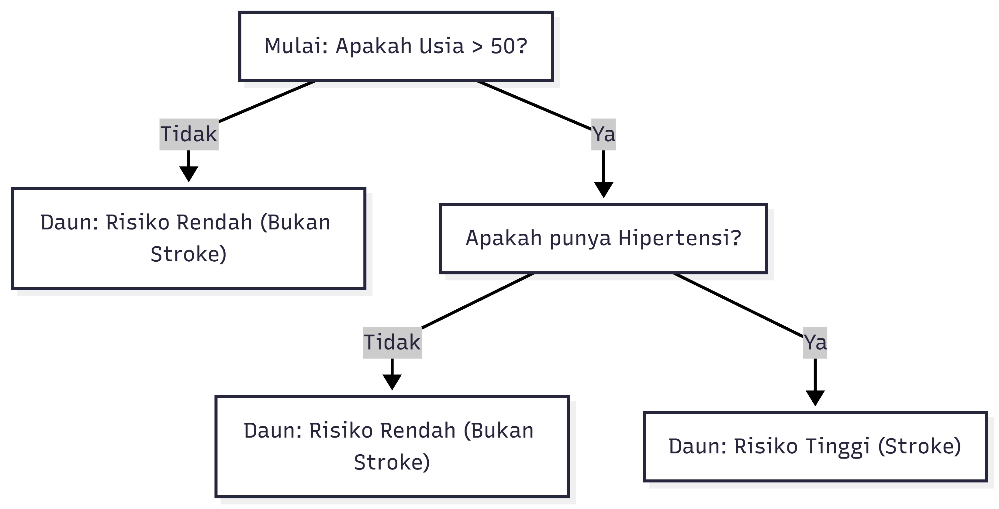
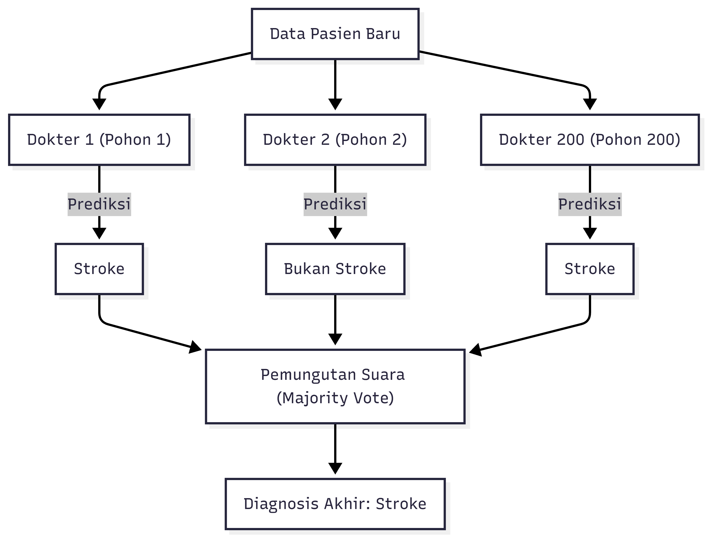
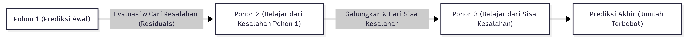

# 🧠 Penjelasan Detail: `training_nhanes.ipynb`

Notebook ini adalah tahap akhir dari proses modeling, di mana kita melatih tiga algoritma machine learning (Decision Tree, Random Forest, dan XGBoost) di bawah 5 skenario eksperimen yang berbeda, mengoptimalkan ambang batas keputusan (*threshold*), serta menganalisis kontribusi fitur menggunakan SHAP.

---

## 1. Mekanisme & Matematika Algoritma Machine Learning (Untuk Ujian AI)

Dosen AI sering menuntut Anda menjelaskan bagaimana algoritma mengambil keputusan di bawah kap:

### A. Decision Tree (Pohon Keputusan)

*   **Analogi Sederhana**: Game **"Tebak-tebakan 20 Pertanyaan"** (seperti Akinator). 
    Bayangkan Anda ingin menebak apakah seorang pasien berisiko stroke. Anda mulai dengan satu pertanyaan utama: *"Apakah usianya di atas 50 tahun?"* 
    * Jika **Tidak**, Anda langsung menyimpulkan *"Risiko Rendah"*.
    * Jika **Ya**, Anda mengajukan pertanyaan berikutnya: *"Apakah dia memiliki riwayat hipertensi?"*
    Setiap pertanyaan membagi data menjadi dua cabang (Ya/Tidak) sampai Anda tiba di kesimpulan akhir di ujung daun pohon.

*   **Visualisasi Konsep**:
    
    


*   **Metrik Pembagian Node (Gini Impurity)**:
    Untuk menentukan pertanyaan mana yang harus ditanyakan terlebih dahulu, algoritma mencari fitur yang menghasilkan pembagian kelompok paling bersih (*pure*). Kita mengukur kekotoran/ketidakmurnian kelompok menggunakan **Gini Impurity**:
    $$Gini(D) = 1 - \sum_{i=1}^{C} p_{i}^2$$
    * Di mana $p_{i}$ adalah probabilitas kelas $i$ pada node tersebut.
    * Nilai Gini = 0 berarti kelompok sudah murni (semua responden di node itu stroke semua, atau sehat semua). Target pohon adalah memperkecil nilai Gini ini di setiap cabang baru.
*   **Kelebihan/Kekurangan**: Sangat mudah dibaca manusia (IF-THEN), tetapi sangat mudah *overfitting* (terlalu menghafal data latihan) jika pohon dibiarkan tumbuh terlalu tinggi tanpa batas.

---

### B. Random Forest (Hutan Acak)

*   **Analogi Sederhana**: **"Musyawarah 200 Dokter Ahli"** (*Wisdom of the Crowd*).
    Jika Anda pergi ke 1 dokter (Decision Tree), dokter tersebut mungkin salah mendiagnosis Anda karena bias pribadinya. 
    Untuk mengatasinya, Anda mengumpulkan **200 dokter** di satu ruangan secara paralel. Masing-masing dokter diberikan sebagian rekam medis Anda secara acak. Setiap dokter membuat diagnosisnya sendiri-sendiri secara mandiri. Di akhir, mereka melakukan **voting (pemungutan suara)**. Jika 150 dokter mendiagnosis *"Stroke"* dan 50 mendiagnosis *"Sehat"*, keputusan akhir kelompok adalah *"Stroke"*.

*   **Visualisasi Konsep**:
    
    


*   **Cara Kerja**:
    1.  **Bootstrap Sampling**: Membuat 200 subset data latihan acak dengan pengembalian untuk melatih setiap pohon secara independen.
    2.  **Fitur Acak**: Di setiap cabang pohon, hanya subset fitur acak (misal $\sqrt{24} \approx 5$ fitur) yang boleh dipilih. Ini menjamin antar pohon/dokter tidak saling meniru dan memiliki keahlian yang berbeda-beda.
    3.  **Voting**: Menggabungkan hasil prediksi seluruh pohon secara paralel untuk keputusan akhir.
*   **Mengapa Lebih Baik?** Penggabungan pohon secara paralel mengurangi variansi model secara signifikan, membuat Random Forest sangat tahan terhadap *overfitting* dibanding Decision Tree tunggal.

---

### C. XGBoost (Extreme Gradient Boosting)

*   **Analogi Sederhana**: **"Siswa Belajar Ujian Susulan"** (*Sequential Learning*).
    Berbeda dengan Random Forest di mana para dokter bekerja bersamaan secara mandiri, XGBoost bekerja seperti siswa yang belajar secara bertahap:
    * **Pohon 1** mencoba memprediksi risiko stroke, tetapi membuat banyak kesalahan (misalnya, gagal mendeteksi pasien stroke usia muda).
    * **Pohon 2** dibuat khusus untuk mempelajari dan **memperbaiki kesalahan** yang dibuat oleh Pohon 1.
    * **Pohon 3** dibuat untuk memperbaiki sisa kesalahan gabungan Pohon 1 + Pohon 2, dan begitu seterusnya.
    Setiap pohon baru secara sekuensial menutupi kelemahan pohon-pohon sebelumnya hingga model menjadi sangat kuat.

*   **Visualisasi Konsep**:
    
    


*   **Fungsi Objektif dengan Regularisasi**:
    XGBoost meminimalkan fungsi loss (kesalahan prediksi) ditambah pinalti ukuran pohon (regularisasi) agar pohon tidak menjadi terlalu rumit:
    $$\mathcal{L}(\phi) = \sum_{i} l(\hat{y}_i, y_i) + \sum_{k} \Omega(f_k)$$
    * Di mana $\Omega(f)$ bertugas menghukum pohon yang terlalu dalam atau memiliki daun terlalu banyak, menjaga model tetap efisien.
*   **Mengapa Lebih Baik?** Akurasinya sangat tinggi karena model terus-menerus memperbaiki kesalahannya sendiri menggunakan optimasi *Gradient Descent*, namun memerlukan pengaturan parameter (*tuning*) yang ketat agar tidak terlalu menghafal kesalahan data latihan.

---

## 2. Metrik Evaluasi Model (Mengapa F1-Score & AUC-ROC?)

Dalam kasus deteksi medis stroke yang tidak seimbang (*imbalanced data*), metrik akurasi biasa dapat menyesatkan penguji:

*   **Mengapa Akurasi (Accuracy) Menyesatkan?**
    *   Jika 96.4% responden sehat dan 3.6% stroke, model malas yang memprediksi "semua orang sehat" akan tetap memiliki **Akurasi 96.4%**. Namun, model ini gagal total karena tidak mendeteksi satu pun pasien stroke.
*   **Precision vs. Recall**:
    *   **Precision**: Dari semua orang yang diprediksi stroke, berapa banyak yang benar-benar stroke?
        $$\text{Precision} = \frac{TP}{TP + FP}$$
    *   **Recall (Sensitivity)**: Dari semua orang yang aslinya stroke, berapa banyak yang berhasil dideteksi model?
        $$\text{Recall} = \frac{TP}{TP + FN}$$
*   **F1-Score**: Rata-rata harmonik dari Precision dan Recall.
    $$\text{F1-Score} = 2 \times \frac{\text{Precision} \times \text{Recall}}{\text{Precision} + \text{Recall}}$$
    F1-Score memberikan gambaran keseimbangan yang adil antara mendeteksi sebanyak-banyaknya pasien stroke (Recall tinggi) tanpa terlalu sering salah memvonis orang sehat sebagai sakit (Precision tinggi).
*   **AUC-ROC (Area Under the Receiver Operating Characteristic Curve)**:
    *   ROC adalah kurva yang memplot *True Positive Rate* (Recall) vs. *False Positive Rate* ($FP / (TN + FP)$) pada berbagai ambang batas klasifikasi (0.0 hingga 1.0).
    *   **AUC** berkisar antara 0.5 (tebakan acak/buruk) hingga 1.0 (klasifikasi sempurna). Nilai AUC menunjukkan probabilitas bahwa model akan menempatkan sampel positif acak lebih tinggi daripada sampel negatif acak.

---

## 3. Threshold Tuning menggunakan Youden's J-Statistic

Secara default, model machine learning memvonis kelas 1 jika probabilitasnya $\ge 0.5$. Namun, pada data imbalance, probabilitas prediksi model untuk kelas minoritas sering kali berkumpul di angka rendah (misal di bawah 0.3).

*   **Youden's J-Statistic**:
    Digunakan untuk mencari nilai ambang batas (*threshold*) optimal pada kurva ROC.
    $$J = \text{Sensitivity} + \text{Specificity} - 1$$
    *   Di mana $\text{Sensitivity} = \text{Recall} = \frac{TP}{TP + FN}$.
    *   $\text{Specificity} = \frac{TN}{TN + FP}$ (kemampuan memprediksi kelas negatif dengan benar).
*   **Bagaimana J-Statistic Memilih 0.2344?**
    *   Algoritma mencari titik pada kurva ROC yang memiliki jarak vertikal terjauh dari garis diagonal tebakan acak. Titik ini memaksimalkan nilai $J$.
    *   Pada proyek ini, nilai threshold diturunkan menjadi **0.2344**.
    *   **Dampaknya**: F1-Score melonjak sangat drastis (hingga **+81.5%** pada skenario C). Ini karena model diturunkan toleransi deteksinya untuk memastikan pasien stroke yang memiliki gejala minoritas tetap terdeteksi (meningkatkan *Recall* secara masif dengan penurunan *Precision* yang terkendali).

---

## 4. Analisis & Penjelasan Parameter Model (Hyperparameters)

Ketika melatih model di `training_nhanes.ipynb`, kita tidak menggunakan nilai default bawaan library, melainkan menentukan parameter tertentu (*hyperparameters*). Berikut adalah rincian mengapa parameter tersebut digunakan dan mengapa nilainya diatur sekian:

### A. Decision Tree (Pohon Keputusan)
```python
DecisionTreeClassifier(max_depth=6, random_state=42, class_weight='balanced')
```
1.  **`max_depth=6`** (Kedalaman Maksimum):
    *   *Kenapa dibatasi 6?* Parameter ini membatasi seberapa banyak tingkat/cabang pertanyaan yang boleh dibuat oleh pohon keputusan. Jika tidak dibatasi (default = `None`), pohon akan terus bercabang hingga sangat detail sampai menghafal data latihan secara spesifik (noise). Ini akan menyebabkan *overfitting* yang parah. Batas 6 dipilih secara empiris sebagai titik optimal (*sweet spot*) antara model yang tidak terlalu sederhana (*underfitting*) dan tidak terlalu rumit (*overfitting*).
2.  **`random_state=42`** (Seed Pengacak):
    *   *Kenapa harus 42?* Algoritma ini menggunakan fungsi pengacakan untuk membagi cabang jika ada fitur dengan nilai kebersihan (Gini) yang sama. Menentukan angka `random_state` (bisa angka berapa saja, namun 42 adalah standar industri yang populer) menjamin hasil pembuatan pohon bersifat *reproducible* (dapat direplikasi sama persis setiap kali notebook dijalankan ulang).
3.  **`class_weight='balanced'`** (Bobot Kelas Seimbang):
    *   *Kenapa menggunakan 'balanced'?* Karena data stroke sangat tidak seimbang (minoritas). Parameter ini menginstruksikan model untuk menghitung bobot penalti kesalahan secara otomatis berbanding terbalik dengan frekuensi kelas: $w_c = \frac{N_{\text{sampel}}}{N_{\text{kelas}} \times N_c}$. Model akan memberikan pinalti yang jauh lebih berat jika salah memprediksi pasien stroke, memaksa model lebih sensitif terhadap kelas minoritas.

---

### B. Random Forest (Hutan Acak)
```python
RandomForestClassifier(n_estimators=200, max_depth=8, random_state=42, class_weight='balanced', n_jobs=-1)
```
1.  **`n_estimators=200`** (Jumlah Pohon):
    *   *Kenapa harus 200 pohon?* Ini adalah jumlah pohon keputusan independen yang akan dibuat di dalam hutan acak. Semakin banyak pohon, prediksi rata-rata akan semakin stabil. Jumlah 200 dipilih karena memberikan performa yang optimal. Menambah pohon di atas 200 hanya akan memperlambat komputasi tanpa memberikan peningkatan performa yang signifikan (grafik performa sudah konvergen/mendatar).
2.  **`max_depth=8`** (Kedalaman Pohon di Hutan):
    *   *Kenapa diatur 8 (lebih dalam dari Decision Tree tunggal)?* Karena Random Forest menggabungkan hasil 200 pohon secara paralel (bagging), variansi model sudah tereduksi secara alami. Oleh karena itu, kita bisa melonggarkan kedalaman masing-masing pohon (dari kedalaman 6 menjadi 8) untuk menangkap pola interaksi fitur yang lebih kompleks, tanpa khawatir terjadi overfitting ekstrem.
3.  **`class_weight='balanced'`**: Sama seperti pada Decision Tree, memberikan penalti kesalahan lebih tinggi pada pendeteksian pasien stroke agar model tidak didominasi kelas mayoritas (sehat).
4.  **`n_jobs=-1`** (Paralelisasi Prosesor):
    *   *Kenapa -1?* Parameter ini menginstruksikan Python untuk menggunakan seluruh core prosesor/CPU komputer yang tersedia untuk melatih 200 pohon secara paralel. Ini sangat menghemat waktu training.

---

### C. XGBoost (Extreme Gradient Boosting)
```python
XGBClassifier(n_estimators=200, max_depth=6, learning_rate=0.05, random_state=42, eval_metric='logloss', scale_pos_weight=10, verbosity=0)
```
1.  **`n_estimators=200`** (Jumlah Iterasi Boosting):
    *   *Kenapa 200?* Ini adalah jumlah pohon keputusan sekuensial yang akan dibangun berturut-turut untuk mengoreksi kesalahan pohon sebelumnya.
2.  **`max_depth=6`** (Kedalaman Pohon Boosting):
    *   *Kenapa 6?* Berbeda dengan Random Forest, boosting membangun pohon secara berurutan untuk mempelajari kesalahan residual. Karena sifat sekuensial ini, kedalaman masing-masing pohon harus dijaga tetap dangkal (biasanya antara 3 sampai 6) agar model tidak terlalu cepat menghafal detail kesalahan kecil (*overfitting*).
3.  **`learning_rate=0.05`** (Tingkat Pembelajaran / Shrinkage):
    *   *Kenapa nilainya kecil (0.05)?* Menentukan seberapa besar kontribusi setiap pohon baru untuk mengoreksi model secara keseluruhan. Nilai kecil (0.05) membuat model belajar secara bertahap dan halus. Pembelajaran lambat ini terbukti secara empiris meningkatkan kemampuan generalisasi model pada data baru dan mencegah model tersesat dalam pencarian minimum global pada loss function.
4.  **`scale_pos_weight=10`** (Bobot Penyeimbang Positif):
    *   *Kenapa nilainya 10?* Ini adalah parameter penyeimbang kelas khusus XGBoost (sebagai pengganti `class_weight` di sklearn). Angka 10 berarti kesalahan klasifikasi pada kelas positif (stroke) akan diberi bobot 10 kali lebih penting daripada kelas negatif (sehat). Nilai ini diatur berdasarkan rasio ketidakseimbangan kelas awal (antara 1:10 hingga 1:27) untuk mendorong model lebih sensitif mendeteksi kasus stroke.
5.  **`eval_metric='logloss'`** (Metrik Evaluasi Internal):
    *   *Kenapa logloss?* Logarithmic loss adalah metrik kerugian yang mengevaluasi performa probabilitas model selama training. Ini menghukum dengan keras prediksi yang salah tetapi memiliki tingkat keyakinan (probabilitas) tinggi, yang mengarahkan model untuk menghasilkan probabilitas prediksi yang lebih akurat.

---

## 5. Pertanyaan Kritis yang Sering Ditanyakan Dosen Penguji

### Q1: Mengapa Random Forest dipilih sebagai model terbaik proyek, padahal XGBoost secara teori lebih kompleks?
> **Jawaban Utama:**
> Random Forest memberikan performa yang jauh lebih stabil dan konsisten pada data uji tanpa menunjukkan tanda-tanda overfitting ekstrem.
>
> **Penjelasan Teknis:**
> Dataset NHANES setelah displit dan diuji memiliki jumlah baris terbatas (~1000 data uji). XGBoost yang merupakan algoritma *boosting* berurutan sangat sensitif terhadap pola pencilan dan rentan mempelajari noise dari data uji yang sempit jika tidak diregularisasi dengan sangat ketat.
> Sebaliknya, Random Forest menggunakan bagging paralel yang melakukan perataan (*averaging*) prediksi dari 200 pohon independen. Hal ini membuat Random Forest lebih kokoh (*robust*) dan memiliki variabilitas performa yang lebih aman untuk diimplementasikan pada web aplikasi Next.js/FastAPI.

---

### Q2: Bagaimana cara kerja SHAP (SHapley Additive exPlanations) secara matematis?
> **Jawaban Utama:**
> SHAP didasarkan pada konsep **Shapley Values** dari teori permainan kooperatif (*Game Theory*).
>
> **Penjelasan Teknis:**
> *   **Analogi**: Prediksi model dianggap sebagai "game", dan fitur-fitur (seperti `age`, `systolic_bp`) dianggap sebagai "pemain" yang bekerja sama untuk memenangkan skor prediksi.
> *   **Kalkulasi**: SHAP menghitung kontribusi marginal dari setiap fitur ke hasil prediksi akhir dengan mengevaluasi semua kemungkinan subset fitur lainnya ($S$).
>     $$\phi_i = \sum_{S \subseteq F \setminus \{i\}} \frac{|S|!(|F| - |S| - 1)!}{|F|!} \left[ f(S \cup \{i\}) - f(S) \right]$$
>     *   Di mana $F$ adalah total fitur, dan $f(S)$ adalah prediksi model hanya menggunakan subset fitur $S$.
>     *   SHAP menguji seberapa besar prediksi berubah saat fitur $i$ ditambahkan ke kombinasi fitur $S$. Rata-rata tertimbang dari semua perubahan ini menghasilkan nilai SHAP untuk fitur tersebut.
