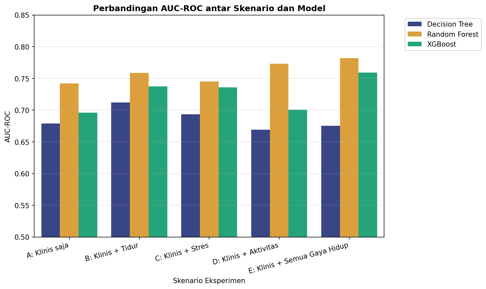
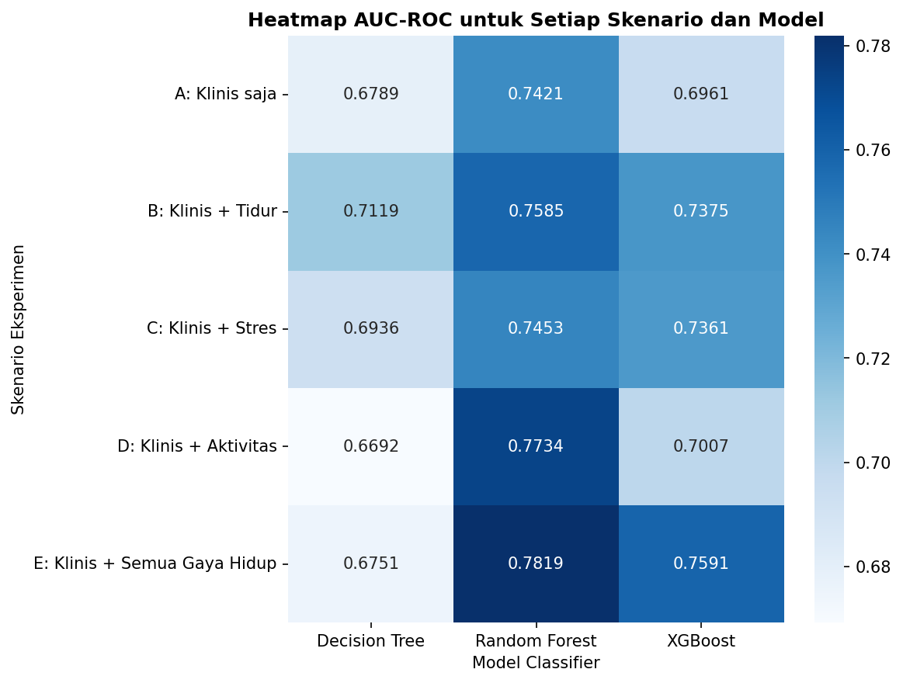
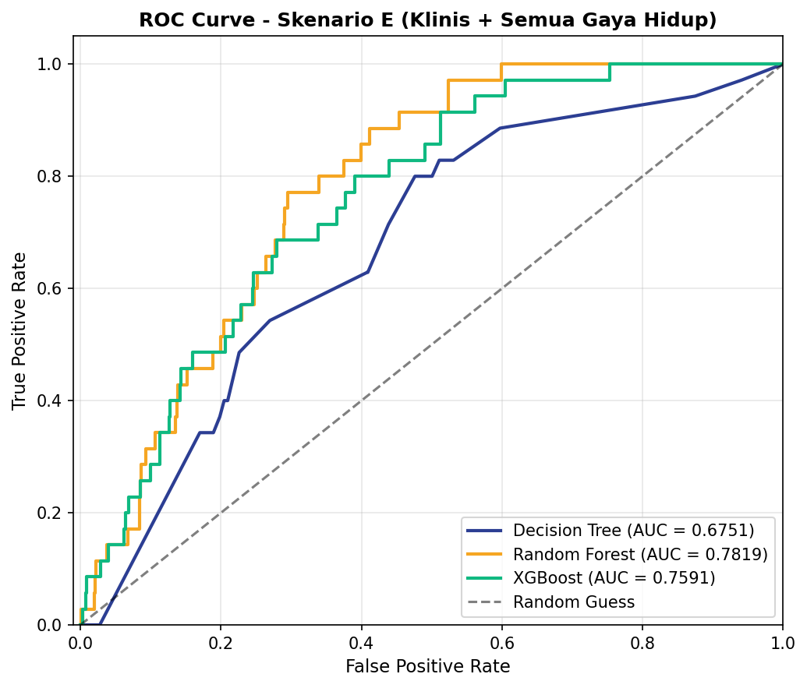
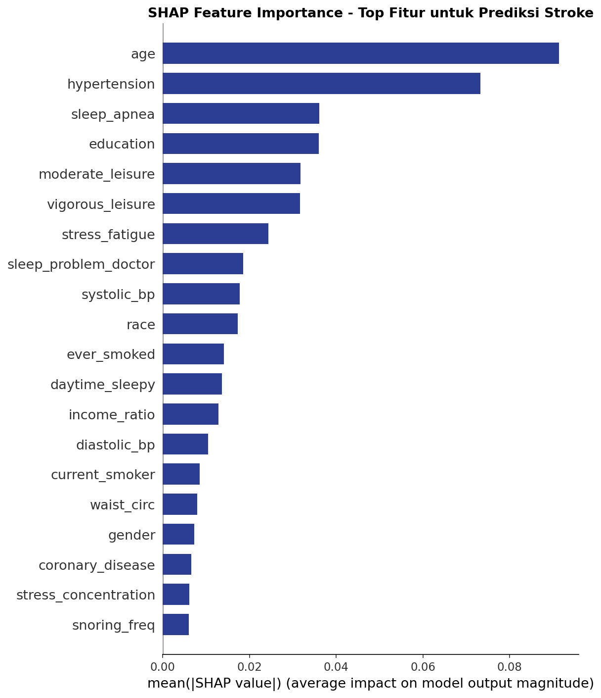
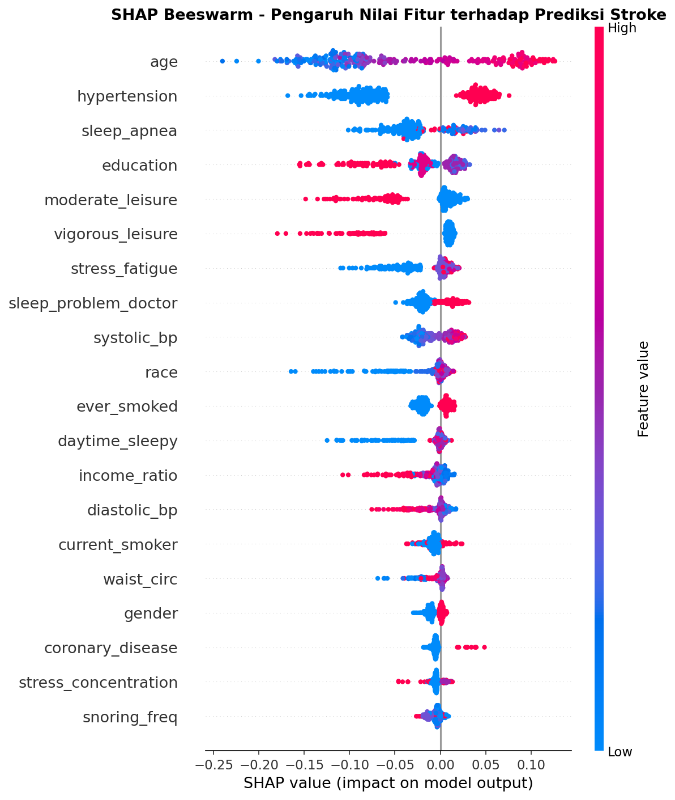
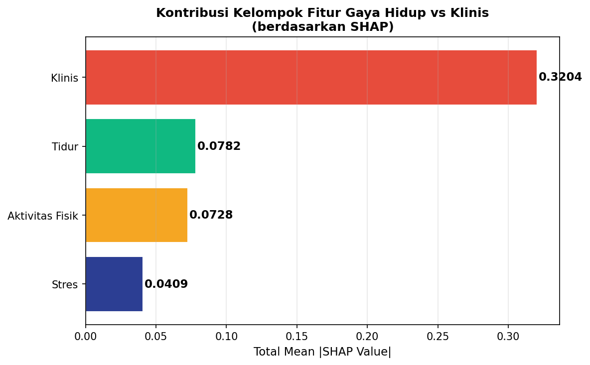

# Dokumentasi Progress 2 - Training dan Evaluasi Model

Dokumen ini menjelaskan detail teknis pelaksanaan Progress 2 dalam proyek **Analisis Faktor Gaya Hidup pada Prediksi Risiko Stroke menggunakan Explainable Machine Learning**, yang mencakup mekanisme algoritma klasifikasi, parameter model, metrik evaluasi, serta analisis hasil eksperimen.

---

## 1. Mekanisme & Parameter Algoritma Klasifikasi

Proyek ini membandingkan tiga algoritma dengan pendekatan matematis yang berbeda untuk menguji ketangguhannya dalam mengklasifikasikan risiko stroke:

### A. Decision Tree
* **Cara Kerja**: 
  Decision Tree membagi dataset secara rekursif berdasarkan kondisi fitur yang menghasilkan pemisahan kelas terbaik (menggunakan metrik *Gini Impurity* atau *Entropy*). Proses *splitting* berlanjut hingga membentuk struktur *decision tree* yang logis dari *root* hingga *leaf*.
* **Parameter yang Digunakan**:
  * `max_depth=6`: Membatasi *max depth tree* hingga 6 tingkat untuk mencegah model menghafal *training data* secara berlebihan (*overfitting*).
  * `class_weight='balanced'`: Menyesuaikan bobot kelas secara otomatis berbanding terbalik dengan frekuensi kelas pada *training data*. Hal ini penting untuk mengimbangi *class imbalance* (stroke = 1 sangat sedikit), memberikan penalti yang lebih besar jika model salah mengklasifikasikan pasien stroke.
  * `random_state=42`: Menjamin hasil *splitting tree* yang konsisten saat dijalankan ulang (*reproducible*).

### B. Random Forest
* **Cara Kerja**:
  Random Forest adalah metode *Ensemble Learning* berbasis *Bagging* (Bootstrap Aggregating). Algoritma ini membuat kumpulan (*forest*) Decision Tree secara acak sebanyak 200 *tree*. Setiap *tree* dilatih menggunakan sampel bootstrap (sub-sampel acak dengan pengembalian) dan subset fitur acak. Prediksi akhir ditentukan melalui voting mayoritas (*majority voting*) dari seluruh *tree*, sehingga sangat tangguh terhadap noise dan mengurangi variansi (*overfitting*).
* **Parameter yang Digunakan**:
  * `n_estimators=200`: Menggunakan 200 *decision tree* untuk membangun *forest* guna menstabilkan performa voting.
  * `max_depth=8`: Membatasi *depth* setiap *individual tree* hingga 8 tingkat agar kompleksitas komputasi terjaga dan tetap generalisasi.
  * `class_weight='balanced'`: Menggunakan pembobotan seimbang di setiap *tree* untuk menangani ketidakseimbangan kelas (*class imbalance*).
  * `n_jobs=-1`: Memanfaatkan seluruh core CPU yang tersedia untuk mempercepat proses training paralel.

### C. XGBoost (Extreme Gradient Boosting)
* **Cara Kerja**:
  XGBoost adalah metode *Ensemble Learning* berbasis *Boosting*. Berbeda dengan Random Forest yang melatih *tree* secara independen, XGBoost melatih *tree* secara sekuensial (bergantian). *Tree* baru dilatih khusus untuk meminimalkan kesalahan prediksi (*residual error*) dari *tree-tree* sebelumnya menggunakan teknik *Gradient Descent* pada fungsi kerugian (*Loss Function*).
* **Parameter yang Digunakan**:
  * `n_estimators=200`: Jumlah *tree boosting* yang dibangun secara sekuensial.
  * `max_depth=6`: Membatasi *max depth* setiap *tree* sekuensial sebesar 6 tingkat.
  * `learning_rate=0.05`: Menentukan ukuran langkah (*shrinkage*) pembaruan bobot model pada setiap iterasi. Nilai kecil (0.05) membuat proses belajar lebih lambat namun lebih presisi dan mencegah *overfitting*.
  * `scale_pos_weight=10`: Mengatur sensitivitas terhadap kelas positif (stroke) sebesar 10 kali lipat dibanding kelas negatif untuk menangani ketidakseimbangan kelas (*class imbalance*).
  * `eval_metric='logloss'`: Fungsi kerugian yang dievaluasi selama training untuk memantau performa model.

---

## 2. Pengertian Metrik Evaluasi

Pada klasifikasi dengan ketidakseimbangan kelas tinggi (*imbalanced data*), metrik evaluasi harus dipahami dengan cermat:

* **Accuracy (Akurasi)**:
  $$\text{Accuracy} = \frac{\text{True Positive} + \text{True Negative}}{\text{Total Sampel}}$$
  Metrik ini mengukur persentase tebakan benar secara keseluruhan. Pada kasus ini, karena 96% data adalah kelas "Tidak Stroke", akurasi baseline akan sangat tinggi (~96%) meskipun model memprediksi semua orang sehat. Oleh karena itu, metrik ini bukan acuan utama.
* **Precision (Presisi)**:
  $$\text{Precision} = \frac{\text{True Positive}}{\text{True Positive} + \text{False Positive}}$$
  Mengukur ketepatan prediksi positif: dari semua orang yang diprediksi stroke oleh model, berapa banyak yang benar-benar mengalami stroke. Presisi tinggi meminimalkan salah diagnosis (*false alarm*).
* **Recall (Sensitivitas)**:
  $$\text{Recall} = \frac{\text{True Positive}}{\text{True Positive} + \text{False Negative}}$$
  Mengukur sensitivitas model: dari semua orang yang sebenarnya stroke, berapa persen yang berhasil dideteksi oleh model. Recall sangat penting dalam medis karena kelalaian mendeteksi penderita stroke (*False Negative*) dapat berakibat fatal.
* **F1-Score**:
  $$\text{F1-Score} = 2 \times \frac{\text{Precision} \times \text{Recall}}{\text{Precision} + \text{Recall}}$$
  Rata-rata harmonik antara Precision dan Recall. Memberikan gambaran performa yang lebih seimbang di tengah ketidakseimbangan kelas.
* **AUC-ROC (Area Under the Receiver Operating Characteristic Curve)**:
  Mengukur performa model dalam membedakan kelas positif (stroke) dan negatif (sehat) pada berbagai ambang batas keputusan (*threshold*). Nilainya berkisar antara `0.5` (tebakan acak) hingga `1.0` (sempurna). AUC-ROC merupakan metrik paling stabil dan tepercaya untuk mengevaluasi klasifikasi pada *imbalanced data*.

---

## 3. Hasil Eksperimen & Analisis Training

Eksperimen dilakukan dengan melatih ketiga model pada 5 skenario kombinasi fitur, menghasilkan metrik sebagai berikut:

| Skenario | Model | Accuracy | Precision | Recall | F1-Score | AUC-ROC |
|---|---|---|---|---|---|---|
| **A: Klinis saja (Baseline)** | Decision Tree | 0.7868 | 0.0539 | 0.3143 | 0.0921 | 0.6789 |
| | Random Forest | 0.8487 | 0.0719 | 0.2857 | 0.1149 | 0.7421 |
| | XGBoost | 0.9028 | 0.0676 | 0.1429 | 0.0917 | 0.6961 |
| **B: Klinis + Tidur** | Decision Tree | 0.7957 | 0.0609 | 0.3429 | 0.1034 | 0.7119 |
| | Random Forest | 0.8959 | 0.0920 | 0.2286 | 0.1311 | 0.7585 |
| | XGBoost | 0.9224 | 0.0769 | 0.1143 | 0.0920 | 0.7375 |
| **C: Klinis + Stres** | Decision Tree | 0.7947 | 0.0735 | 0.4286 | 0.1255 | 0.6936 |
| | Random Forest | 0.8782 | 0.0594 | 0.1714 | 0.0882 | 0.7453 |
| | XGBoost | 0.9263 | 0.1154 | 0.1714 | 0.1379 | 0.7361 |
| **D: Klinis + Aktivitas** | Decision Tree | 0.7721 | 0.0661 | 0.4286 | 0.1145 | 0.6692 |
| | Random Forest | 0.8654 | 0.0820 | 0.2857 | 0.1274 | 0.7734 |
| | XGBoost | 0.9263 | 0.1000 | 0.1429 | 0.1176 | 0.7007 |
| **E: Klinis + Semua Gaya Hidup** | Decision Tree | 0.8016 | 0.0628 | 0.3429 | 0.1062 | 0.6751 |
| | **Random Forest (Best)** | **0.9057** | **0.0822** | **0.1714** | **0.1111** | **0.7819** |
| | XGBoost | 0.9303 | 0.1087 | 0.1429 | 0.1235 | 0.7591 |

### Kontekstualisasi Arti Metrik pada Hasil Eksperimen (Model Terbaik: Random Forest Skenario E)
* **Accuracy (0.9057 / 90.57%)**: Artinya model berhasil memprediksi secara benar status stroke maupun sehat pada 90.57% pasien di dataset test. Nilai ini sangat tinggi namun dipengaruhi oleh tebakan kelas mayoritas (pasien tidak stroke).
* **Precision (0.0822 / 8.22%)**: Dari seluruh pasien yang diprediksi mengalami risiko stroke oleh Random Forest, hanya 8.22% yang secara medis terbukti stroke pada data aktual. Nilai ini tergolong rendah karena kejadian stroke memang sangat langka di populasi (~3.6%), namun performa ini jauh lebih baik dibanding model menebak secara acak.
* **Recall (0.1714 / 17.14%)**: Model mampu mendeteksi 17.14% dari total penderita stroke yang sebenarnya ada di data uji. Nilai ini merepresentasikan *trade-off* model agar menjaga sensitivitas deteksi dini tanpa membuat terlalu banyak salah prediksi (*false positive*).
* **AUC-ROC (0.7819 / 78.19%)**: Metrik utama performa stabil. Menunjukkan tingkat kemampuan model dalam membedakan orang yang berisiko stroke vs orang sehat sebesar 78.19%. Angka di atas 0.75 dianggap solid untuk data klinis yang sangat tidak seimbang.

### Visualisasi Hasil Eksperimen & Interpretasinya

#### Perbandingan AUC-ROC per Skenario & Model

Diagram batang ini memvisualisasikan performa AUC-ROC dari tiga model pada kelima skenario eksperimen. Terlihat jelas bahwa **Random Forest** mendominasi performa terbaik di hampir seluruh skenario, dan performanya terus meningkat secara linier seiring penambahan fitur gaya hidup.

#### Heatmap AUC-ROC Semua Kombinasi

Representasi warna matriks AUC-ROC untuk memudahkan perbandingan nilai numerik secara instan. Warna biru yang semakin pekat menunjukkan performa model yang semakin baik. Area terpekat berada pada kolom **Random Forest** di baris **Skenario E** (0.7819).

#### Kurva ROC Skenario E

Kurva ini memplot rasio True Positive (Recall) terhadap False Positive pada berbagai threshold. Garis putus-putus diagonal mewakili tebakan acak (AUC = 0.50). Semakin melengkung kurva mendekati sudut kiri atas, performanya semakin optimal. Kurva **Random Forest** berada paling atas dengan cakupan area terluas (AUC = 0.7819).

### Analisis Utama Performa Model:
1. **Random Forest Menjadi Model Terbaik**:
   Random Forest menghasilkan AUC-ROC tertinggi secara konsisten di setiap skenario. Pada **Skenario E** (gabungan data klinis dan seluruh variabel gaya hidup), Random Forest mencatat **AUC-ROC = 0.7819**, menjadikannya model dengan kemampuan pemisahan risiko stroke terbaik.
2. **Kontribusi Faktor Gaya Hidup**:
   * Penambahan variabel **Tidur** ke baseline klinis (Skenario B) meningkatkan AUC-ROC Random Forest sebesar **+0.0164** (dari 0.7421 ke 0.7585).
   * Penambahan variabel **Stres** (Skenario C) meningkatkan AUC-ROC sebesar **+0.0032**.
   * Penambahan variabel **Aktivitas Fisik** (Skenario D) memberikan peningkatan AUC-ROC sebesar **+0.0313** (mencapai 0.7734).
   * Ketika seluruh variabel gaya hidup digabungkan (Skenario E), model mencapai performa puncak dengan peningkatan AUC-ROC sebesar **+0.0398** dibandingkan baseline klinis. Hal ini secara empiris membuktikan bahwa integrasi faktor gaya hidup secara kolektif meningkatkan akurasi prediksi risiko stroke secara signifikan.

---

## 4. Interpretabilitas Model (SHAP Analysis)

Berdasarkan analisis nilai SHAP (*SHapley Additive exPlanations*) pada model Random Forest terbaik (Skenario E), kontribusi kelompok fitur diurutkan dari yang paling dominan mempengaruhi keputusan model:

1. **Klinis (Clinical)**: Akumulasi nilai SHAP sebesar **0.3204**. Faktor klinis dasar seperti usia (*age*), riwayat penyakit jantung/hipertensi, serta indeks masa tubuh (*bmi*) masih mendominasi keputusan prediksi.
2. **Tidur (Sleep)**: Akumulasi nilai SHAP sebesar **0.0782**. Ini menunjukkan bahwa faktor pola tidur (seperti durasi tidur dan keluhan tidur ke dokter) merupakan faktor gaya hidup paling berpengaruh dibanding gaya hidup lain harian.
3. **Aktivitas Fisik (Physical Activity)**: Akumulasi nilai SHAP sebesar **0.0728**. Terutama dipengaruhi oleh durasi waktu *sedentary* (duduk/berbaring tanpa aktivitas) harian.
4. **Stres/Depresi (Stress)**: Akumulasi nilai SHAP sebesar **0.0409**. Gejala kehilangan minat (*anhedonia*) dan kelelahan (*fatigue*) berkontribusi pada penentuan risiko psikologis pasien.

### Visualisasi Analisis SHAP & Interpretasinya

#### SHAP Global Feature Importance

Diagram batang ini mengurutkan 20 fitur paling berpengaruh berdasarkan nilai rata-rata absolut SHAP harian. Fitur dengan bar terpanjang (seperti usia/*age*, riwayat penyakit jantung, *bmi*, dan tekanan darah) memiliki dampak paling kuat dalam menentukan probabilitas risiko stroke.

#### SHAP Beeswarm Plot

Beeswarm plot menunjukkan kontribusi nilai tinggi/rendah suatu fitur terhadap prediksi.
  * **Warna Merah** = Nilai fitur tinggi; **Warna Biru** = Nilai fitur rendah.
  * **Titik di kanan garis tengah (SHAP > 0)** = Meningkatkan risiko stroke; **Titik di kiri (SHAP < 0)** = Menurunkan risiko.
  * *Contoh*: Titik merah pada fitur `age`, `systolic_bp`, dan `bmi` berada di sisi kanan, menunjukkan bahwa pertambahan usia, naiknya tekanan darah sistolik, dan naiknya BMI meningkatkan risiko stroke secara signifikan.

#### Kontribusi Kelompok Fitur

Barplot horizontal ini membandingkan kontribusi kumulatif dari 4 kelompok fitur berdasarkan nilai rata-rata SHAP. Kelompok **Klinis** memegang peran utama (0.3204), disusul secara ketat oleh kelompok gaya hidup **Tidur** (0.0782) dan **Aktivitas Fisik** (0.0728), sementara kelompok **Stres** (0.0409) memiliki kontribusi terkecil namun tetap memberikan dampak positif dalam penyempurnaan akurasi prediksi model.
