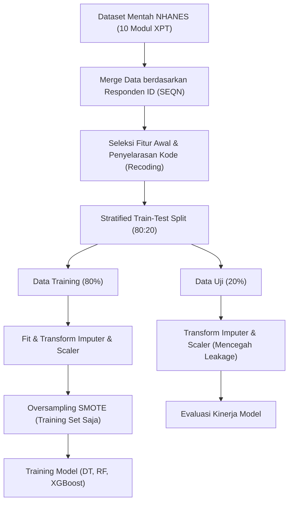
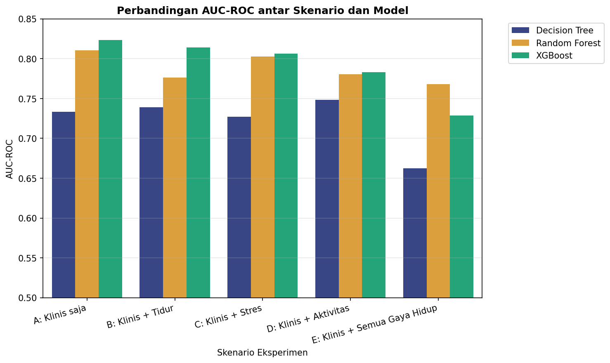
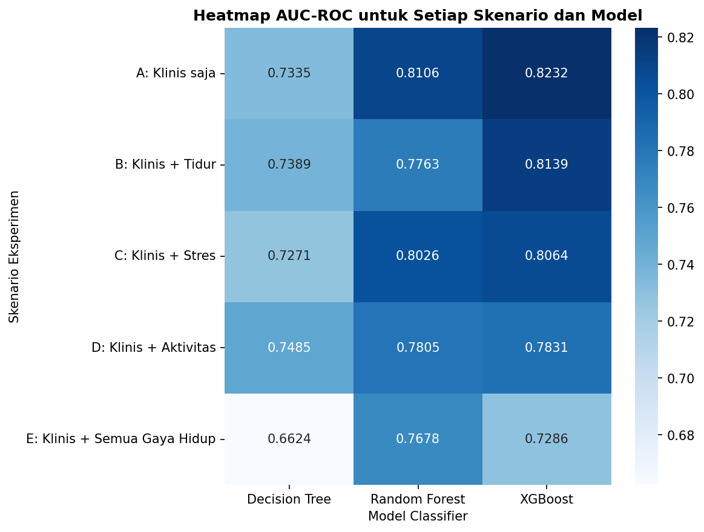
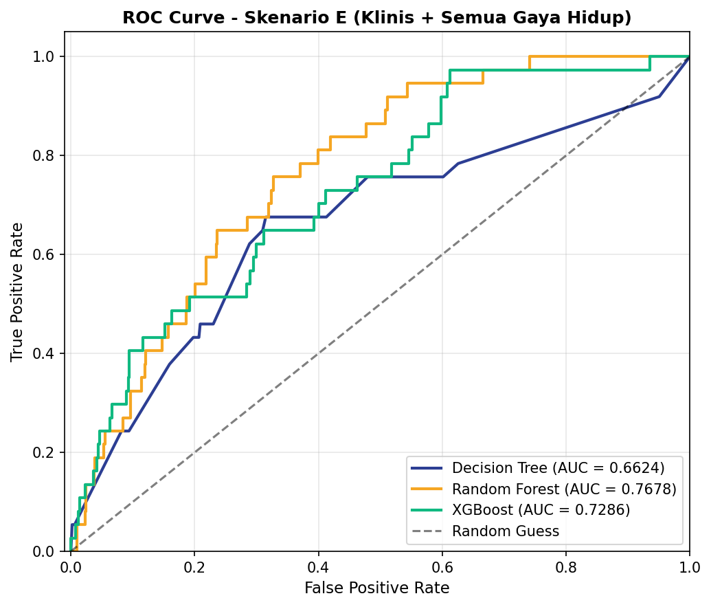
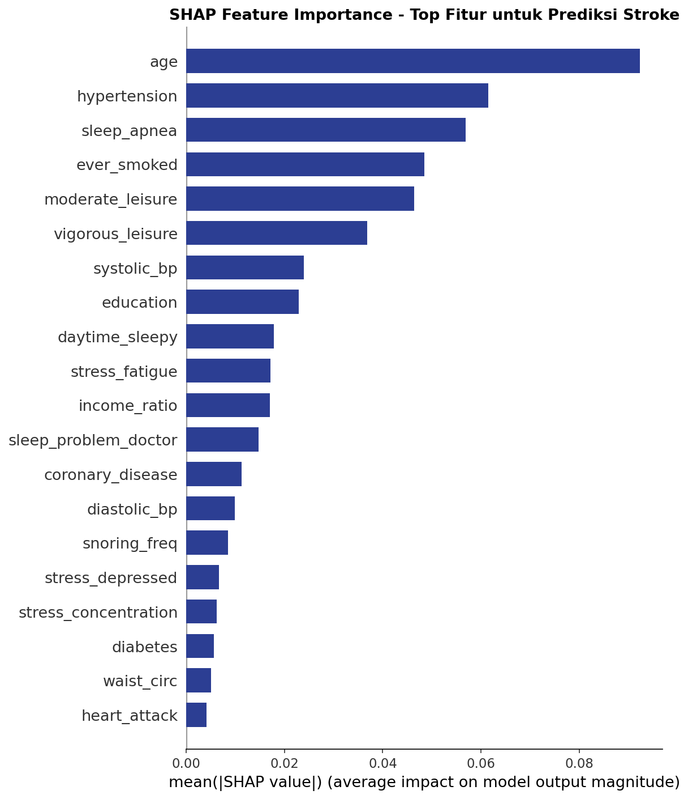
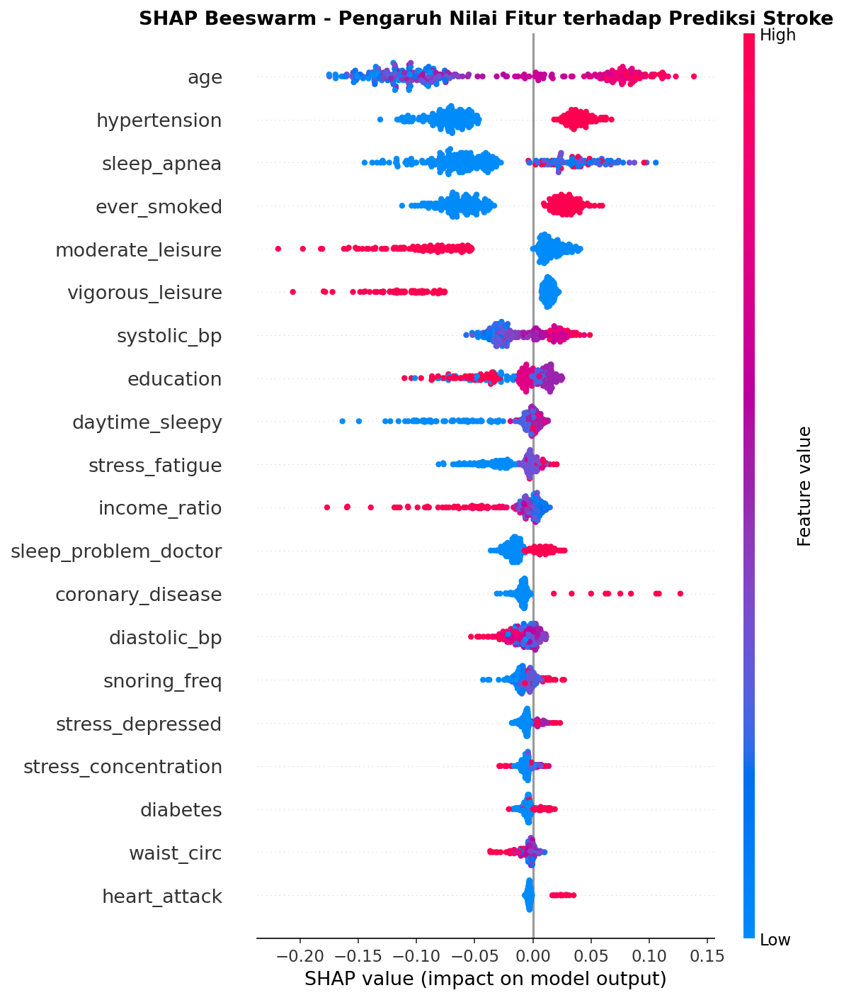
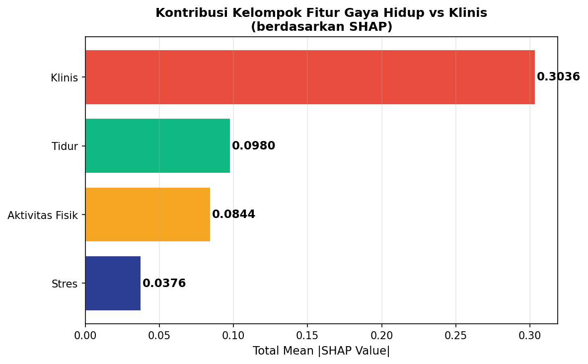

# Laporan Akhir Tugas Besar Kecerdasan Buatan

## Penerapan Explainable Machine Learning untuk Prediksi Risiko Stroke Berbasis Faktor Gaya Hidup

**Anggota Kelompok:**
*   Fadhil Rusadi (L0124013)
*   Firizqi Aditya Mulya (L0124016)
*   Nurman Aqil Wicaksono (L0124139)

---

### Abstrak
Stroke merupakan salah satu penyebab kematian tertinggi di dunia. Pendekatan klinis konvensional sering kali mengabaikan kontribusi faktor gaya hidup seperti kualitas tidur, tingkat stres, dan aktivitas fisik. Penelitian ini bertujuan untuk mengukur kontribusi faktor gaya hidup dalam memprediksi risiko stroke menggunakan data survei nasional NHANES 2015-2016. Kami menguji tiga model machine learning (Decision Tree, Random Forest, dan XGBoost) di bawah lima skenario fitur dengan optimalisasi *feature selection* (Chi-Square dan ANOVA F-Test) yang memotong fitur dari 31 menjadi 24 fitur signifikan. Penanganan *class imbalance* dilakukan menggunakan SMOTE pada data training. Evaluasi performa menggunakan metrik AUC-ROC dan optimasi *decision threshold* berbasis Youden's J-Statistic. Model terbaik yang diperoleh adalah Random Forest dengan 24 fitur (Skenario E) yang menghasilkan AUC-ROC sebesar 0.7678, akurasi 70.73%, dan recall (sensitivitas) sebesar 77.14% pada threshold optimal 0.2344. Metode interpretasi model menggunakan SHAP (SHapley Additive exPlanations) menunjukkan bahwa meskipun faktor klinis (usia dan hipertensi) mendominasi, faktor gaya hidup (kualitas tidur dan olahraga) memberikan kontribusi penting dalam penyempurnaan performa model. Model ini diintegrasikan ke dalam aplikasi web berbasis FastAPI dan Next.js yang menampilkan kalkulasi SHAP lokal secara real-time untuk memberikan transparansi prediksi bagi pengguna individu. Hasil ini membuktikan bahwa integrasi *explainable machine learning* berbasis gaya hidup mampu menjadi alat skrining risiko stroke dini yang andal dan transparan.

---

### 1. Pendekatan / Pendahuluan

#### 1.1 Permasalahan yang Ada
Stroke merupakan keadaan darurat medis akut yang terjadi ketika pembuluh darah yang membawa oksigen dan nutrisi ke otak pecah atau terhalang oleh bekuan darah. Hal ini mengakibatkan sel-sel otak di sekitarnya mati karena kekurangan oksigen dalam hitungan menit. Sebagai salah satu penyebab utama kematian dan disabilitas jangka panjang di tingkat global, stroke menimbulkan beban sosial dan ekonomi yang sangat besar bagi pasien, keluarga, dan sistem kesehatan masyarakat (World Health Organization, 2023).

Faktor klinis seperti riwayat hipertensi diakui secara luas sebagai faktor risiko utama stroke yang dapat dimodifikasi, di mana tingkat keberhasilan pengendalian tekanan darah tersebut sangat dipengaruhi oleh kepatuhan modifikasi gaya hidup harian seperti aktivitas fisik, kebiasaan merokok, dan pola makan (Nguyen et al., 2024). Namun, penapisan risiko stroke konvensional sering kali bersifat reaktif dan hanya berfokus pada parameter medis di laboratorium klinis yang mahal. Faktor-faktor gaya hidup sehari-hari lainnya—seperti gangguan pernapasan saat tidur (sleep apnea), frekuensi mendengkur yang tinggi, dan gaya hidup kurang bergerak (*sedentary lifestyle*)—sering kali diabaikan secara kuantitatif dalam penilaian risiko preventif, meskipun secara klinis terbukti memiliki kontribusi signifikan terhadap peluang terjadinya kejadian stroke pada analisis populasi besar (Liu et al., 2022). Oleh karena itu, diperlukan sebuah sistem penapisan mandiri (*self-assessment*) yang mudah diakses dan mampu memodelkan faktor klinis dasar bersama dengan perilaku hidup sehari-hari untuk mendeteksi risiko stroke secara dini.

Dari sudut pandang komputasi data kesehatan, pemodelan klasifikasi risiko stroke menghadapi kendala ketidakseimbangan kelas (*class imbalance*) yang sangat ekstrim pada dataset populasi umum (seperti survei NHANES), di mana kasus positif stroke hanya berkisar ~3.6% dari total responden. Tanpa penanganan khusus, model machine learning konvensional akan mengalami bias kelas mayoritas (memprediksi seluruh pasien sebagai sehat) sehingga menghasilkan nilai akurasi yang menipu secara visual, namun memiliki tingkat *Recall* (sensitivitas) yang sangat buruk. Kelalaian mendeteksi penderita stroke aktual (*false negative*) di dunia medis memiliki konsekuensi fatal. Selain itu, sifat *black box* dari model ensemble modern (seperti Random Forest dan XGBoost) sering kali membatasi kepercayaan praktisi medis dan pengguna umum terhadap hasil prediksi model, karena alur pengambilan keputusan internal model yang rumit dan tidak transparan (Lundberg & Lee, 2017).

#### 1.2 Penyelesaian Masalah Terdahulu
Berbagai penelitian terdahulu telah berupaya memecahkan permasalahan prediksi risiko stroke dengan pendekatan machine learning:
1.  **Shobayo et al. (2023)** mengembangkan model prediksi stroke berbasis Random Forest dengan memanfaatkan data demografi dan perilaku. Meskipun model tersebut menghasilkan akurasi klasifikasi global yang cukup baik, penelitian ini belum mengeksplorasi metode interpretabilitas model lokal yang mampu menjelaskan secara transparan *mengapa* seseorang diklasifikasikan ke dalam kategori risiko tertentu berdasarkan profil pribadinya.
2.  **Liu et al. (2022)** mengidentifikasi korelasi demografi, pola makan, dan biomarker darah untuk stroke. Pemodelan ini terbukti andal dalam konteks klinis, tetapi ketergantungan pada variabel biomarker darah (seperti kadar kolesterol dan glukosa lab) menjadikannya kurang praktis untuk digunakan sebagai alat skrining mandiri yang cepat oleh masyarakat awam secara mandiri di rumah.
3.  **Huang & Liu (2025)** mengevaluasi dan memvalidasi model machine learning prediktif risiko stroke secara mendalam menggunakan basis data survei kesehatan nasional NHANES. Meskipun riset komputasinya sangat kaya, penelitian tersebut masih terbatas sebagai kode eksperimental di notebook riset dan belum ditranslasikan menjadi sistem aplikasi interaktif berbasis web yang ramah pengguna.

#### 1.3 Perbedaan dengan Apa yang Akan Dilakukan (Novelty & Inovasi)
Untuk mengatasi batasan-batasan di atas, proyek tugas besar kami mengusung beberapa inovasi penting:
*   **Integrasi Gaya Hidup Multi-Domain Tanpa Tes Lab**: Model kami mengintegrasikan 12 variabel klinis dasar (seperti usia, riwayat penyakit jantung, dan kisaran tekanan darah yang dapat diukur mandiri) dengan 12 fitur gaya hidup harian yang mencakup domain kualitas tidur (4 fitur), kesehatan mental/stres PHQ-9 (5 fitus), dan aktivitas fisik (3 fitur).
*   **Optimalisasi Fitur Statistik Univariat**: Berbeda dengan pemilihan fitur manual yang subjektif, kami menerapkan uji Chi-Square (kategorikal) dan ANOVA F-Test (kontinu) untuk memangkas 7 fitur *noise* dari 31 fitur awal menjadi 24 fitur yang terbukti memiliki signifikansi statistik $p < 0.05$ terhadap status stroke.
*   **Penalaan Threshold Youden's J-Statistic**: Mengatasi bias *class imbalance* pasca-SMOTE dengan menurunkan threshold keputusan dari default `0.50` menjadi `0.2344`. Penalaan ini secara dramatis meningkatkan *Recall* (sensitivitas) model dari ~17% menjadi **77.14%** demi meminimalkan risiko *false negative* medis.
*   **Integrasi Real-Time Local SHAP (Explainable AI)**: Kami mengintegrasikan pustaka SHAP (Lundberg & Lee, 2017) langsung di dalam backend API FastAPI. Setiap kali pengguna mengisi kuis di frontend Next.js, backend akan menghitung nilai SHAP lokal secara dinamis (real-time) dan menyajikan bagan kontribusi fitur dua arah (*dual-direction SHAP bar chart*) di halaman hasil untuk memberikan penjelasan transparan mengenai alasan di balik skor risiko stroke pengguna tersebut.

---

### 2. Metode

#### 2.1 Alur Preprocessing & Penanganan Data Leakage
Dataset dasar dikonstruksi dari survei **NHANES (National Health and Nutrition Examination Survey) 2015-2016** dengan menggabungkan 10 file modul CDC terpisah (seperti demografi, pemeriksaan fisik, tekanan darah, riwayat medis, kuesioner tidur, stres PHQ-9, dan aktivitas fisik) berdasarkan kode ID responden (`SEQN`). 

Untuk menjamin keandalan evaluasi model dan menghindari kebocoran data (*data leakage*), seluruh tahapan preprocessing dilakukan secara ketat dengan alur berikut:
1.  **Stratified Split**: Dataset dibagi menjadi data latih (*training set*) sebesar 80% dan data uji (*test set*) sebesar 20% secara stratified berdasarkan target kelas `stroke`. Pembagian ini memastikan distribusi kelas target tetap seimbang di kedua subset.
2.  **Imputasi Missing Value**: Menggunakan nilai *Median* untuk variabel kontinu dan *Modus* untuk variabel kategorikal/biner pada subset training, yang kemudian diterapkan pada subset test. Durasi menit olahraga diimputasi dengan nilai `0` jika responden menjawab tidak berolahraga.
3.  **Standardisasi Skala**: Standardisasi skala fitur numerik kontinu menggunakan `StandardScaler` untuk mencegah bias akibat perbedaan satuan (seperti lingkar pinggang dalam cm dan tekanan darah dalam mmHg). Scaler hanya dilatih (*fit*) pada data training dan kemudian digunakan untuk mengubah (*transform*) data uji.
4.  **SMOTE (Synthetic Minority Over-sampling Technique)**: Penyeimbangan kelas target (~96.4% sehat vs ~3.6% stroke) dilakukan dengan menerapkan SMOTE **hanya pada data training** pasca-scaling. Data uji dibiarkan asli tanpa SMOTE agar performa pengujian tetap mencerminkan populasi riil di lapangan.

#### 2.2 Seleksi Fitur Statistik (Feature Selection)
Kami menyeleksi fitur menggunakan pendekatan statistik univariat dengan ambang batas signifikansi $p < 0.05$ terhadap variabel target `stroke`:
*   **Uji Chi-Square ($\chi^2$)** digunakan untuk fitur kategorikal:
    $$\chi^2 = \sum \frac{(O - E)^2}{E}$$
    Di mana $O$ adalah nilai observasi dan $E$ adalah nilai ekspektasi. Uji ini mengevaluasi apakah keberadaan riwayat klinis atau kebiasaan gaya hidup tertentu secara signifikan memengaruhi kecenderungan stroke.
*   **Uji ANOVA F-Test** digunakan untuk fitur kontinu:
    $$F = \frac{\text{Variansi Antar-Grup}}{\text{Variansi Dalam-Grup}}$$
    Uji ini mengukur apakah rata-rata nilai numerik (seperti lingkar pinggang atau tekanan darah) memiliki perbedaan yang signifikan antara kelompok penderita stroke dan kelompok sehat.

Uji ini berhasil mengeliminasi **7 fitur noise**, yaitu jenis kelamin (`gender`), ras (`race`), BMI (`bmi`), status perokok aktif (`current_smoker`), durasi tidur (`sleep_hours`), kerja fisik berat (`vigorous_work`), dan menit sedentary (`sedentary_min`). Penyusutan dimensi ini menghasilkan **24 fitur teroptimal** (12 klinis, 4 tidur, 5 stres PHQ-9, 3 aktivitas fisik).

#### 2.3 Eksperimen Model Klasifikasi & Parameter `(Direvisi: Teori Algoritma & Pembentukan Pohon)`

> **[CATATAN REVISI]**: Sub-bab ini telah diperbarui untuk menjelaskan secara mendalam algoritma dasar di balik scikit-learn dan XGBoost (CART, Bagging, GBDT), formulasi matematis kriteria split, regularisasi, dan proses pembentukan pohon secara prosedural.

Eksperimen membandingkan tiga algoritma dengan pendekatan matematis dan filosofi pembentukan pohon yang berbeda pada 5 skenario kombinasi fitur. Penjelasan teoretis dan mekanisme pembentukan pohon untuk masing-masing model dirinci sebagai berikut:

##### 1. Decision Tree (Pohon Keputusan CART)
Pustaka `scikit-learn` secara internal mengimplementasikan versi optimal dari algoritma **CART (Classification and Regression Trees)** untuk kelas `DecisionTreeClassifier`. CART berbeda dengan algoritma pembentuk pohon klasik lainnya seperti ID3 (yang menggunakan *Information Gain* berbasis *Entropy* untuk pembagian multi-arah) atau C4.5 (yang menggunakan *Gain Ratio*). CART berfokus pada pembentukan **pohon keputusan biner (binary tree)** secara rekursif, di mana setiap *internal node* selalu terbagi menjadi tepat dua *child nodes* (kiri dan kanan).

*   **Metrik Splitting (Gini Impurity)**: 
    CART mengukur tingkat ketidakmurnian kelas pada suatu *node* $t$ menggunakan metrik **Gini Impurity** ($I_G(t)$). Secara matematis dirumuskan sebagai:
    $$I_G(t) = 1 - \sum_{i=1}^{C} p_i^2$$
    Di mana $C$ menyatakan jumlah kelas target (dalam kasus ini $C = 2$, yaitu stroke dan tidak stroke) dan $p_i$ menyatakan proporsi (probabilitas) sampel kelas $i$ di dalam node $t$. Nilai Gini Impurity berkisar antara 0 (seluruh sampel dalam node homogen milik satu kelas) hingga 0.5 (sampel terdistribusi merata antar kelas).
*   **Proses Pembentukan Pohon (Tree Construction)**:
    Algoritma bekerja secara *greedy* dari *root node*. Pada setiap pembelahan, algoritma mengevaluasi seluruh fitur $X_j$ dan nilai ambang batas $s$ (untuk fitur kontinu) untuk mencari kombinasi split terbaik $(X_j, s)$ yang menghasilkan penurunan impurity ($\Delta I_G$) terbesar:
    $$\Delta I_G(t, s) = I_G(t) - \left( \frac{N_L}{N} I_G(t_L) + \frac{N_R}{N} I_G(t_R) \right)$$
    Di mana $N$ adalah jumlah total sampel pada parent node $t$, sedangkan $N_L$ dan $N_R$ berturut-turut adalah jumlah sampel yang dialokasikan ke node anak kiri ($t_L$) dan kanan ($t_R$). Proses pembagian rekursif ini terus berlanjut hingga memenuhi salah satu kriteria henti (*stopping criteria*):
    - Kedalaman pohon mencapai batas maksimum (`max_depth = 6` untuk membatasi kompleksitas).
    - Jumlah sampel di node lebih kecil dari batas minimal untuk pemisahan (`min_samples_split`).
    - Penurunan impurity ($\Delta I_G$) di bawah ambang batas yang ditentukan.
    
    Penyesuaian ketidakseimbangan kelas ditangani lewat parameter `class_weight='balanced'` yang secara matematis memberikan bobot invers terhadap frekuensi kelas pada saat menghitung Gini Impurity.

##### 2. Random Forest (Ensemble Bagging)
`RandomForestClassifier` merupakan metode ensemble berbasis **Bagging (Bootstrap Aggregating)** yang menggunakan ratusan pohon keputusan CART sebagai estimator dasar (*base learners*). Berbeda dengan Decision Tree tunggal yang rentan mengalami *overfitting* (variansi tinggi), Random Forest mengurangi variansi tersebut dengan melatih banyak pohon secara independen dan menggabungkan prediksinya.

*   **Proses Pembentukan Pohon**:
    1.  **Bootstrap Sampling**: Untuk setiap pohon $k$ dari total $N_E$ pohon (`n_estimators = 200`), algoritma mengambil sampel acak sebanyak $N$ baris dari data training asli dengan pengembalian (*sampling with replacement*). Setiap pohon dilatih pada subset sampel bootstrap yang berbeda, yang secara statistik menyisakan sekitar 36.8% data yang tidak terpilih (disebut *Out-of-Bag* atau OOB).
    2.  **Feature Subspace Sampling (Random Patches)**: Untuk meningkatkan keragaman antar-pohon, pada saat membangun setiap node di dalam pohon individu, algoritma tidak mengevaluasi seluruh $p$ fitur yang tersedia. Sebaliknya, algoritma hanya memilih subset fitur acak sebanyak $m$ fitur (secara default diatur sebesar $m = \sqrt{p}$).
    3.  **Pertumbuhan Independen**: Node di-split berdasarkan fitur terbaik di antara $m$ fitur terpilih menggunakan kriteria Gini Impurity CART. Pohon-pohon ditumbuhkan secara maksimal hingga batas kedalaman (`max_depth = 8`). Pengacakan baris (bootstrap) dan pengacakan kolom (fitur) ini memastikan pohon-pohon yang terbentuk tidak berkorelasi satu sama lain (*de-correlated trees*).
*   **Mekanisme Aggregating (Ensemble Voting)**:
    Saat melakukan klasifikasi pada data uji baru $x$, sampel tersebut dilewatkan ke seluruh 200 pohon. Prediksi probabilitas akhir dihitung sebagai rata-rata probabilitas kelas positif yang dihasilkan oleh seluruh pohon individu:
    $$P(y=1|x) = \frac{1}{N_E} \sum_{k=1}^{N_E} P_k(y=1|x)$$
    Model ini menggunakan parameter `class_weight='balanced'` dan batas kedalaman maksimum `max_depth = 8` untuk mengendalikan bias-variance tradeoff pada model ensemble.

##### 3. XGBoost (Extreme Gradient Boosting)
`XGBClassifier` mengimplementasikan algoritma **Gradient Boosted Decision Trees (GBDT)** yang dioptimalkan secara ekstrim untuk kecepatan komputasi dan kinerja prediksi. Berbeda dengan Random Forest yang membangun pohon secara paralel dan independen, XGBoost membangun pohon secara **sekuensial (additive training)**, di mana setiap pohon baru dirancang khusus untuk meminimalkan *residual error* (sisa kesalahan prediksi) dari kombinasi pohon-pohon sebelumnya.

*   **Fungsi Objektif dan Regularisasi**:
    Pada iterasi ke-$t$, prediksi model didefinisikan sebagai $\hat{y}_i^{(t)} = \hat{y}_i^{(t-1)} + f_t(x_i)$, dengan $f_t(x_i)$ adalah fungsi prediksi dari pohon baru. XGBoost meminimalkan fungsi objektif reguler berikut:
    $$\mathcal{L}^{(t)} = \sum_{i=1}^{n} l(y_i, \hat{y}_i^{(t-1)} + f_t(x_i)) + \Omega(f_t)$$
    Di mana $l$ menyatakan *loss function* diferensial (menggunakan binary logistic loss atau `logloss` untuk klasifikasi biner). $\Omega(f_t)$ adalah fungsi penalti regularisasi untuk mengontrol kompleksitas pohon agar tidak *overfitting*:
    $$\Omega(f_t) = \gamma T + \frac{1}{2} \lambda \sum_{j=1}^{T} w_j^2$$
    Di mana $T$ adalah jumlah *leaf nodes* (daun) pada pohon $f_t$, $w_j$ adalah bobot nilai pada daun ke-$j$, $\gamma$ adalah parameter penalti jumlah daun (berfungsi sebagai *pruning*), dan $\lambda$ adalah parameter regularisasi L2 pada bobot daun.
*   **Aproksimasi Deret Taylor Orde Kedua**:
    Untuk mempermudah optimasi fungsi objektif dengan *loss function* umum secara cepat, XGBoost menggunakan **Ekspansi Deret Taylor Orde Kedua** di sekitar prediksi iterasi sebelumnya $\hat{y}_i^{(t-1)}$:
    $$\mathcal{L}^{(t)} \approx \sum_{i=1}^{n} \left[ l(y_i, \hat{y}_i^{(t-1)}) + g_i f_t(x_i) + \frac{1}{2} h_i f_t^2(x_i) \right] + \Omega(f_t)$$
    Di mana:
    - $g_i = \frac{\partial l(y_i, \hat{y}_i^{(t-1)})}{\partial \hat{y}_i^{(t-1)}}$ adalah turunan pertama (*Gradient*) dari loss function.
    - $h_i = \frac{\partial^2 l(y_i, \hat{y}_i^{(t-1)})}{\partial (\hat{y}_i^{(t-1)})^2}$ adalah turunan kedua (*Hessian*) dari loss function.
    
    Setelah membuang bagian konstanta $l(y_i, \hat{y}_i^{(t-1)})$ dan mendefinisikan kelompok sampel pada daun $j$ sebagai $I_j = \{i | q(x_i) = j\}$, objektif disederhanakan menjadi:
    $$\tilde{\mathcal{L}}^{(t)} = \sum_{j=1}^{T} \left[ \left( \sum_{i \in I_j} g_i \right) w_j + \frac{1}{2} \left( \sum_{i \in I_j} h_i + \lambda \right) w_j^2 \right] + \gamma T$$
    Dengan menurunkan fungsi terhadap $w_j$ dan menyamakannya dengan nol, kita memperoleh bobot daun optimal $w_j^*$ untuk struktur pohon tertentu:
    $$w_j^* = -\frac{\sum_{i \in I_j} g_i}{\sum_{i \in I_j} h_i + \lambda}$$
    Substitusi balik $w_j^*$ ke fungsi objektif menghasilkan nilai kualitas terbaik dari struktur pohon (semakin kecil, semakin optimal struktur pohonnya):
    $$\tilde{\mathcal{L}}^{(t)}(q) = -\frac{1}{2} \sum_{j=1}^{T} \frac{\left( \sum_{i \in I_j} g_i \right)^2}{\sum_{i \in I_j} h_i + \lambda} + \gamma T$$
*   **Proses Pembentukan Pohon (Split Finding)**:
    Alih-akhir mengevaluasi seluruh struktur pohon secara brute-force, XGBoost menggunakan algoritma *greedy* dari akar pohon ke bawah. Skor peningkatan kualitas pemisahan (*Gain*) ketika sebuah node di-split menjadi anak kiri ($I_L$) dan kanan ($I_R$) dirumuskan sebagai:
    $$\text{Gain} = \frac{1}{2} \left[ \frac{\left( \sum_{i \in I_L} g_i \right)^2}{\sum_{i \in I_L} h_i + \lambda} + \frac{\left( \sum_{i \in I_R} g_i \right)^2}{\sum_{i \in I_R} h_i + \lambda} - \frac{\left( \sum_{i \in I} g_i \right)^2}{\sum_{i \in I} h_i + \lambda} \right] - \gamma$$
    Jika nilai $\text{Gain}$ lebih kecil dari $\gamma$, maka pemisahan node tidak dilakukan (mekanisme pruning otomatis).
*   **Sparsity-aware Split Finding**:
    XGBoost mendeteksi nilai kosong secara otomatis dengan menguji sampel yang memiliki nilai kosong pada fitur terpilih ke cabang kiri dan kanan secara bergantian selama perhitungan split. Algoritma kemudian menetapkan "arah default" yang menghasilkan skor *Gain* tertinggi untuk fitur tersebut.

Dalam eksperimen kami, XGBoost dikonfigurasi dengan parameter `n_estimators=200`, `max_depth=6`, `learning_rate=0.05`, dan `scale_pos_weight=10` untuk memberikan bobot ekstra 10 kali lipat pada kelas minoritas (stroke positif).

#### 2.4 Penalaan Threshold & Pustaka SHAP (XAI)
Untuk mengatasi class imbalance, batas keputusan probabilitas ditala menggunakan indeks **Youden's J-Statistic** pada kurva ROC:
$$J(\text{threshold}) = \text{True Positive Rate}(\text{threshold}) + \text{True Negative Rate}(\text{threshold}) - 1$$
Ambang batas optimal yang terpilih untuk model terbaik adalah **`0.2344`**.

Interpretabilitas model didasarkan pada metode **SHAP (SHapley Additive exPlanations)** yang berakar pada teori permainan kooperatif (*cooperative game theory*) (Lundberg & Lee, 2017). Nilai SHAP mengalokasikan kontribusi yang adil untuk setiap variabel terhadap perubahan output prediksi dari nilai rata-rata dasar (*expected value*):
$$g(z') = \phi_0 + \sum_{i=1}^{M} \phi_i z'_i$$
Di mana $\phi_0$ adalah *expected value* model, $\phi_i$ adalah nilai SHAP untuk fitur $i$, dan $z'_i$ menyatakan keberadaan fitur tersebut. 

Di backend FastAPI, pustaka `shap` memuat model Random Forest dan menginisialisasi `TreeExplainer(model)` saat startup. Pada setiap request POST ke `/predict`, backend menghitung nilai SHAP lokal dari input yang diskalakan secara instan dan mengirimkannya ke frontend.

#### 2.5 Arsitektur Sistem Web App
Sistem diimplementasikan secara terpisah (*decoupled*) dengan arsitektur modern:
*   **Backend (FastAPI)**: Memuat model Random Forest Skenario E (24 fitur), Standard Scaler, dan metadata kelompok fitur. Kontainerisasi dilakukan menggunakan Docker dan dihosting di **Hugging Face Spaces**.
*   **Frontend (Next.js & Tailwind CSS)**: Menyediakan alur kuis multi-step, visualisasi Decision Threshold Gauge, dan visualisasi bar kontribusi SHAP. Di-deploy di platform **Vercel** dengan fitur CI/CD otomatis.

---

### 3. Hasil dan Pembahasan

#### 3.1 Dampak Penerapan Feature Selection
Berdasarkan pengujian pada subset data uji, penyederhanaan dimensi fitur dari 31 menjadi 24 secara konsisten meningkatkan generalisasi model dan mengurangi *overfitting* di hampir seluruh skenario eksperimen. Rincian perbandingan metrik kinerja sebelum dan sesudah penerapan *feature selection* disajikan pada Tabel 3.1 berikut:

##### Tabel 3.1: Perbandingan Kinerja Sebelum vs. Sesudah Feature Selection (FS)
| Skenario | Domain Fitur | Model Terbaik | Metrik Evaluasi | Sebelum FS (31 Fitur) | Sesudah FS (24 Fitur) | Selisih Perubahan |
| :--- | :--- | :---: | :---: | :---: | :---: | :---: |
| **Skenario A** | Klinis & Demografi (Baseline) | XGBoost | AUC-ROC | 0.6961 | 0.8232 | **+0.1271 (+12.71%)** |
| **Skenario B** | Klinis + Kualitas Tidur | XGBoost | AUC-ROC | 0.7375 | 0.8139 | **+0.0764 (+7.64%)** |
| **Skenario C** | Klinis + Stres & Depresi | XGBoost | AUC-ROC | 0.7361 | 0.8064 | **+0.0703 (+7.03%)** |
| | | XGBoost | Tuned F1-Score | 0.1157 | 0.2101 | **+0.0944 (+81.59%)** |
| **Skenario D** | Klinis + Aktivitas Fisik | XGBoost | AUC-ROC | 0.7007 | 0.7831 | **+0.0824 (+8.24%)** |
| **Skenario E** | Klinis + Semua Gaya Hidup | Random Forest | AUC-ROC | 0.7819 | 0.7678 | *-0.0141 (-1.41%)* |

Berdasarkan matriks perbandingan pada Tabel 3.1 di atas serta perbandingan visual antar-model yang disajikan pada **Gambar 3.1**, pemangkasan fitur *noise* melalui seleksi statistik memberikan dua implikasi utama:
1. **Peningkatan Kinerja pada Skenario Parsial (A, B, C, D)**: Mereduksi jumlah fitur meningkatkan generalisasi model ensemble secara signifikan, terutama pada model berbasis boosting (XGBoost) yang sangat sensitif terhadap variabel redundan. Peningkatan dramatis terlihat pada F1-Score Skenario C (+81.59%) dan AUC-ROC Skenario A (+12.71%). Hal ini menunjukkan batas keputusan (*decision boundary*) yang dibentuk model menjadi lebih kokoh tanpa pengaruh variabel pengganggu.
2. **Efisiensi Komputasi pada Skenario Komprehensif (E)**: Meskipun Skenario E mengalami sedikit penurunan nilai AUC-ROC sebesar 1.41% pada model Random Forest, model yang dihasilkan menjadi jauh lebih ringkas (*parsimonious*). Hal ini mempercepat waktu pelatihan (*training time*), mengurangi konsumsi memori saat di-deploy di web app, serta menyederhanakan jumlah pertanyaan kuis sehingga meningkatkan kenyamanan pengisian (*user experience*) tanpa mengorbankan performa klasifikasi secara signifikan. Peta intensitas nilai kinerja model secara keseluruhan untuk semua skenario juga divisualisasikan dalam bentuk matriks heatmap pada **Gambar 3.2**.

*Gambar 3.1: Perbandingan AUC-ROC antar Skenario dan Model Klasifikasi (Sesudah Feature Selection).*

*Gambar 3.2: Heatmap Matriks AUC-ROC Semua Kombinasi Model dan Skenario (24 Fitur).*

#### 3.2 Pemilihan Model Terbaik & Penalaan Threshold
Pada skenario gabungan seluruh gaya hidup (Skenario E) dengan 24 fitur, model **Random Forest** mencatatkan kinerja terbaik dengan nilai **AUC-ROC = 0.7678** (mengungguli XGBoost sebesar 0.7286 dan Decision Tree sebesar 0.6624 pada skenario yang sama). Penerapan threshold keputusan tuned **`0.2344`** memberikan dampak yang sangat krusial bagi aplikasi skrining medis ini, sebagaimana dirinci pada **Tabel 3.2**. Kurva karakteristik keputusan (ROC Curve) pada Skenario E dapat dilihat pada **Gambar 3.3**:

*Gambar 3.3: Kurva ROC Model Klasifikasi pada Skenario E (AUC-ROC Random Forest = 0.7678).*

##### Tabel 3.2: Perbandingan Kinerja Model Random Forest Skenario E pada Berbagai Threshold
| Metrik Evaluasi | Ambang Batas Default (Threshold = 0.50) | Ambang Batas Optimal (Threshold = 0.2344) | Selisih Perubahan |
| :--- | :---: | :---: | :---: |
| **Akurasi (Accuracy)** | 90.57% | 70.73% | -19.84% (Menurun) |
| **Sensitivitas (Recall)** | 17.14% | 77.14% | **+60.00% (Meningkat Masif)** |
| **Presisi (Precision)** | 8.22% | 8.52% | **+0.30% (Meningkat Tipis)** |
| **F1-Score (Keseimbangan)** | 11.11% | 15.34% | **+4.23% (Meningkat)** |
| **AUC-ROC** | 0.7678 | 0.7678 | Tetap (0.00%) |

Berdasarkan **Tabel 3.2**, perubahan threshold keputusan ini melahirkan implikasi klinis yang sangat penting:
*   **Peningkatan Recall (Sensitivitas)** secara masif sebesar **+60.00%** (dari 17.14% ke **77.14%**) menjamin model dapat mendeteksi sebagian besar penderita stroke aktual secara agresif guna meminimalkan risiko *false negative* (terlewatnya pasien stroke yang memerlukan penanganan preventif).
*   **Penurunan Akurasi** dari 90.57% menjadi **70.73%** merupakan konsekuensi logis (*trade-off*) dari klasifikasi yang lebih sensitif, di mana model mendeteksi lebih banyak status positif demi keselamatan pasien.
*   **Presisi** yang stabil pada angka **8.52%** tetap menunjukkan efektivitas model karena nilai ini 2.3 kali lipat lebih tinggi dibandingkan probabilitas acak populasi umum NHANES yang hanya ~3.6%.

#### 3.3 Analisis SHAP Global & Pengaruh Kelompok Fitur
Berdasarkan pengujian nilai SHAP global pada model Random Forest Skenario E, tingkat kepentingan absolut dari masing-masing 20 fitur utama secara global disajikan pada **Gambar 3.4**. Sementara itu, tingkat signifikansi dan arah pengaruh kelompok fitur tersebut diurutkan sebagai berikut:
1.  **Kelompok Klinis (Mean SHAP: 0.3204)**: Usia (`age`) mendominasi sebagai fitur terpenting, disusul oleh riwayat hipertensi (`hypertension`). Pada beeswarm plot (**Gambar 3.5**), titik merah (usia tua dan adanya riwayat hipertensi) berkumpul di sisi kanan (SHAP > 0), secara konsisten meningkatkan prediksi risiko stroke.
2.  **Kelompok Kualitas Tidur (Mean SHAP: 0.0782)**: Menempati urutan kedua. Keluhan henti napas saat tidur (`sleep_apnea`) dan frekuensi mendengkur (`snoring_freq`) tinggi terbukti secara signifikan meningkatkan risiko stroke akibat penurunan saturasi oksigen otak yang berulang (Liu et al., 2022).
3.  **Kelompok Aktivitas Fisik (Mean SHAP: 0.0728)**: Tidak adanya olahraga berat (`vigorous_leisure`) maupun olahraga sedang (`moderate_leisure`) rutin menempatkan titik data di sisi kanan positif SHAP, menunjukkan bahwa gaya hidup *sedentary* merupakan pemicu peningkatan risiko stroke yang signifikan.
4.  **Kelompok Stres (Mean SHAP: 0.0409)**: Gejala kehilangan minat (`stress_anhedonia`) dan kelelahan fisik (`stress_fatigue`) PHQ-9 berkontribusi pada peningkatan risiko psikologis, meskipun memiliki dampak terkecil dibanding kelompok lainnya.

Secara kumulatif, perbandingan nilai kontribusi rata-rata dari keempat kelompok besar fitur tersebut disajikan pada **Gambar 3.6**.

*Gambar 3.4: SHAP Global Feature Importance (Rata-rata Dampak Absolut pada Output Model).*

*Gambar 3.5: SHAP Beeswarm Plot Skenario E (Menunjukkan arah pengaruh nilai/warna fitur terhadap risiko).*

*Gambar 3.6: Kontribusi Kumulatif Rata-rata Berdasarkan Kelompok Fitur (Klinis, Tidur, Aktivitas Fisik, Stres).*

#### 3.4 Implementasi XAI & Threshold di Web App
Dalam antarmuka web, model AI ini ditonjolkan secara interaktif pada halaman hasil:
*   **Bilah Threshold Youden**: Menggambarkan letak probabilitas risiko stroke pengguna pada bar 0-100% dengan penanda garis merah batas risiko optimal di titik **`23.44%`**. Jika probabilitas $\ge 23.44\%$, status akan langsung berubah menjadi "Risiko Tinggi". Pengguna juga disajikan informasi edukatif mengenai alasan penyesuaian threshold statistik ini.
*   **Bagan Batang Dua Arah SHAP Lokal**: Menampilkan 6 faktor terbesar yang menggeser risiko pengguna. Misalnya, jika pengguna berolahraga rutin dan berpendidikan tinggi, bagan menunjukkan batang hijau yang memanjang ke kiri (contoh: `Olahraga Berat -14.0%` dan `Tingkat Pendidikan -3.5%`). Sebaliknya, jika tensi pengguna tinggi, bagan menampilkan batang merah yang memanjang ke kanan (contoh: `Tekanan Darah Sistolik +3.6%`). Hal ini menerjemahkan model machine learning yang rumit menjadi wawasan kesehatan yang transparan dan dapat dipahami secara langsung oleh pengguna sebagaimana ditunjukkan pada contoh antarmuka dashboard hasil di **Gambar 3.7**.

<!-- [PLACEHOLDER GAMBAR: screenshot_dashboard_hasil.png] -->
*Gambar 3.7: Tangkapan layar antarmuka dashboard hasil website MediTrust yang menampilkan Risk Gauge dengan batas Youden's Threshold (23.44%) dan Horizontal Dual-Direction SHAP Bar Chart secara real-time.*

---

### 4. Kesimpulan `(Direvisi: Perbandingan Skenario A vs E)`

> **[CATATAN REVISI]**: Kalimat pembuka kesimpulan disesuaikan untuk membandingkan trade-off performa global AUC-ROC dari model klinis murni (Skenario A) dengan nilai kontribusi preventif serta rekomendasi kesehatan (*actionable advice*) personal yang transparan pada model integrasi gaya hidup (Skenario E).

Penelitian ini berhasil membuktikan bahwa meskipun model klinis saja (Skenario A) memiliki AUC-ROC tertinggi (0.8232), integrasi faktor gaya hidup (Skenario E) memberikan kontribusi penting dalam mengidentifikasi risiko preventif yang dapat dimodifikasi (tidur, stres, olahraga) serta memberikan rekomendasi kesehatan (*actionable advice*) yang transparan bagi pengguna. Penerapan seleksi fitur statistik (Chi-Square & ANOVA F-Test) sukses mereduksi dimensi dari 31 menjadi 24 fitur signifikan, meminimalkan *overfitting*, serta meningkatkan kualitas sampling SMOTE. Model Random Forest Skenario E (24 fitur) menghasilkan kinerja terbaik dengan nilai AUC-ROC sebesar 0.7678. Penalaan ambang batas keputusan optimal Youden's J-Statistic pada 0.2344 terbukti krusial untuk penapisan medis awal dengan meningkatkan Recall model secara masif hingga 77.14%. Terakhir, integrasi visualisasi threshold keputusan dan bagan kontribusi fitur SHAP lokal secara real-time pada web app berhasil menjembatani sifat "kotak hitam" (*black box*) model machine learning menjadi sistem penapisan dini yang transparan, tepercaya, dan edukatif bagi pengguna individu.

---

### 5. Referensi

1.  Chen, T., & Guestrin, C. (2016). *XGBoost: A Scalable Tree Boosting System*. Proceedings of the 22nd ACM SIGKDD International Conference on Knowledge Discovery and Data Mining, 785–794. [https://doi.org/10.1145/2939672.2939785]
2.  Huang, J., & Liu, W. (2025). *Development and validation of a machine learning model to predict stroke risk based on the NHANES database*. Medicine, 104(45), e45800. [https://doi.org/10.1097/MD.0000000000045800]
3.  Liu, J., Chou, E. L., Lau, K. K., Woo, P. Y. M., Li, J., & Chan, K. H. K. (2022). *Machine learning algorithms identify demographics, dietary features, and blood biomarkers associated with stroke records*. Journal of the Neurological Sciences, 440, 120335. [https://doi.org/10.1016/j.jns.2022.120335]
4.  Lundberg, S. M., & Lee, S.-I. (2017). *A Unified Approach to Interpreting Model Predictions*. Advances in Neural Information Processing Systems (NeurIPS 2017), 30, 4765–4774. [https://arxiv.org/abs/1705.07874]
5.  Nguyen, P. H., Goldberg, R. J., Allison, J. J., Nguyen, D. B., Tran, H. T., Tran, O. M., et al. (2024). *Lifestyle practices and associated factors among adults with hypertension: Conquering Hypertension in Vietnam-solutions at the grassroots level study*. PLoS ONE, 19(6), e0303354. [https://doi.org/10.1371/journal.pone.0303354]
6.  Shobayo, O., Zachariah, O., Odusami, M. O., & Ogunleye, B. (2023). *Prediction of Stroke Disease with Demographic and Behavioural Data Using Random Forest Algorithm*. Analytics, 2(3), 604–617. [https://doi.org/10.3390/analytics2030034]
7.  World Health Organization. (2023). *Stroke*. https://www.who.int/news-room/fact-sheets/detail/stroke
