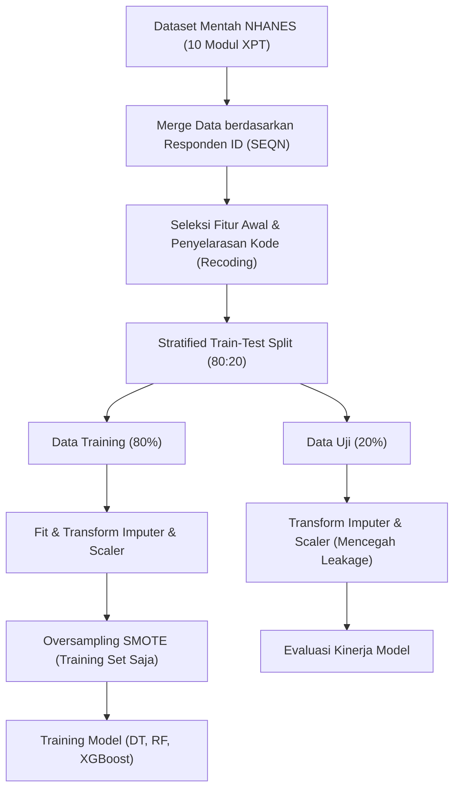

# Laporan Akhir Tugas Besar Kecerdasan Buatan

## Penerapan Explainable Machine Learning untuk Prediksi Risiko Stroke Berbasis Faktor Gaya Hidup

**Anggota Kelompok:**
*   Fadhil Rusadi (L0124013)
*   Firizqi Aditya Mulya (L0124016)
*   Nurman Aqil Wicaksono (L0124139)

---

### Abstrak
Stroke merupakan salah satu penyebab kematian tertinggi di dunia. Pendekatan klinis konvensional sering kali mengabaikan kontribusi faktor gaya hidup seperti kualitas tidur, tingkat stres, dan aktivitas fisik. Penelitian ini bertujuan untuk mengukur kontribusi faktor gaya hidup dalam memprediksi risiko stroke menggunakan data survei nasional NHANES 2015-2016. Kami menguji tiga model machine learning (Decision Tree, Random Forest, dan XGBoost) di bawah lima skenario fitur dengan optimalisasi *feature selection* (Chi-Square dan ANOVA F-Test) yang memotong fitur dari 31 menjadi 24 fitur signifikan. Penanganan *class imbalance* dilakukan menggunakan SMOTE pada data training. Evaluasi performa menggunakan metrik AUC-ROC dan optimasi *decision threshold* berbasis Youden's J-Statistic. Model terbaik yang diperoleh adalah Random Forest dengan 24 fitur (Skenario E) yang menghasilkan AUC-ROC sebesar 0.7678, akurasi 70.73%, dan recall (sensitivitas) sebesar 77.14% pada threshold optimal 0.2344. Metode interpretasi model menggunakan SHAP (SHapley Additive exPlanations) menunjukkan bahwa meskipun faktor klinis (usia dan hipertensi) mendominasi, faktor gaya hidup (kualitas tidur dan olahraga) memberikan kontribusi penting dalam penyempurnaan performa model. Model ini diintegrasikan ke dalam aplikasi web berbasis FastAPI dan Next.js yang menampilkan kalkulasi SHAP lokal secara real-time untuk memberikan transparansi prediksi bagi pengguna individu. Hasil ini membuktikan bahwa integrasi *explainable machine learning* berbasis gaya hidup mampu menjadi alat skrining risiko stroke dini yang andal dan transparan.

---

### 1. Pendekatan / Pendahuluan

#### 1.1 Permasalahan yang Ada
Stroke merupakan keadaan darurat medis akut yang terjadi ketika pembuluh darah yang membawa oksigen dan nutrisi ke otak pecah atau terhalang oleh bekuan darah. Hal ini mengakibatkan sel-sel otak di sekitarnya mati karena kekurangan oksigen dalam hitungan menit. Sebagai salah satu penyebab utama kematian dan disabilitas jangka panjang di tingkat global, stroke menimbulkan beban sosial dan ekonomi yang sangat besar bagi pasien, keluarga, dan sistem kesehatan masyarakat. 

Faktor klinis seperti riwayat hipertensi, diabetes melitus, dan penyakit kardiovaskular secara medis diakui sebagai pemicu utama kerusakan pembuluh darah otak (arterosklerosis) (Nguyen et al., 2022). Namun, penapisan risiko stroke konvensional sering kali bersifat reaktif dan hanya berfokus pada parameter medis di laboratorium klinis yang mahal. Faktor-faktor gaya hidup sehari-hari—seperti gangguan pernapasan saat tidur (sleep apnea), frekuensi mendengkur yang tinggi, tingkat stres psikologis kronis (anhedonia, depresi), dan gaya hidup kurang bergerak (*sedentary lifestyle*)—sering kali diabaikan secara kuantitatif dalam penilaian risiko preventif, meskipun secara klinis terbukti memiliki korelasi kuat dengan peningkatan beban hemodinamik jantung (Liu et al., 2022). Oleh karena itu, diperlukan sebuah sistem penapisan mandiri (*self-assessment*) yang mudah diakses dan mampu memodelkan faktor klinis dasar bersama dengan perilaku hidup sehari-hari untuk mendeteksi risiko stroke secara dini.

Dari sudut pandang komputasi data kesehatan, pemodelan klasifikasi risiko stroke menghadapi kendala ketidakseimbangan kelas (*class imbalance*) yang sangat ekstrim pada dataset populasi umum (seperti survei NHANES), di mana kasus positif stroke hanya berkisar ~3.6% dari total responden. Tanpa penanganan khusus, model machine learning konvensional akan mengalami bias kelas mayoritas (memprediksi seluruh pasien sebagai sehat) sehingga menghasilkan nilai akurasi yang menipu secara visual, namun memiliki tingkat *Recall* (sensitivitas) yang sangat buruk. Kelalaian mendeteksi penderita stroke aktual (*false negative*) di dunia medis memiliki konsekuensi fatal. Selain itu, sifat *black box* dari model ensemble modern (seperti Random Forest dan XGBoost) sering kali membatasi kepercayaan praktisi medis dan pengguna umum terhadap hasil prediksi model, karena alur pengambilan keputusan internal model yang rumit dan tidak transparan (Lundberg & Lee, 2017).

#### 1.2 Penyelesaian Masalah Terdahulu
Berbagai penelitian terdahulu telah berupaya memecahkan permasalahan prediksi risiko stroke dengan pendekatan machine learning:
1.  **Shobayo et al. (2023)** mengembangkan model prediksi stroke berbasis Random Forest dengan memanfaatkan data demografi dan perilaku. Meskipun model tersebut menghasilkan akurasi klasifikasi global yang cukup baik, penelitian ini belum mengeksplorasi metode interpretabilitas model lokal yang mampu menjelaskan secara transparan *mengapa* seseorang diklasifikasikan ke dalam kategori risiko tertentu berdasarkan profil pribadinya.
2.  **Liu et al. (2022)** mengidentifikasi korelasi demografi, pola makan, dan biomarker darah untuk stroke. Pemodelan ini terbukti andal dalam konteks klinis, tetapi ketergantungan pada variabel biomarker darah (seperti kadar kolesterol dan glukosa lab) menjadikannya kurang praktis untuk digunakan sebagai alat skrining mandiri yang cepat oleh masyarakat awam secara mandiri di rumah.
3.  **Huang & Liu (2025)** mengevaluasi dan memvalidasi model machine learning prediktif risiko stroke secara mendalam menggunakan basis data survei kesehatan nasional NHANES. Meskipun riset komputasinya sangat kaya, penelitian tersebut masih terbatas sebagai kode eksperimental di notebook riset dan belum ditranslasikan menjadi sistem aplikasi interaktif berbasis web yang ramah pengguna.

#### 1.3 Perbedaan dengan Apa yang Akan Dilakukan (Novelty & Inovasi)
Untuk mengatasi batasan-batasan di atas, proyek tugas besar kami mengusung beberapa inovasi penting:
*   **Integrasi Gaya Hidup Multi-Domain Tanpa Tes Lab**: Model kami mengintegrasikan 12 variabel klinis dasar (seperti usia, riwayat penyakit jantung, dan kisaran tekanan darah yang dapat diukur mandiri) dengan 12 fitur gaya hidup harian yang mencakup domain kualitas tidur (4 fitur), kesehatan mental/stres PHQ-9 (5 fitus), dan aktivitas fisik (3 fitur).
*   **Optimalisasi Fitur Statistik Univariat**: Berbeda dengan pemilihan fitur manual yang subjektif, kami menerapkan uji Chi-Square (kategorikal) dan ANOVA F-Test (kontinu) untuk memangkas 7 fitur *noise* dari 31 fitur awal menjadi 24 fitur yang terbukti memiliki signifikansi statistik $p < 0.05$ terhadap status stroke.
*   **Penalaan Threshold Youden's J-Statistic**: Mengatasi bias *class imbalance* pasca-SMOTE dengan menurunkan threshold keputusan dari default `0.50` menjadi `0.2344`. Penalaan ini secara dramatis meningkatkan *Recall* (sensitivitas) model dari ~17% menjadi **77.14%** demi meminimalkan risiko *false negative* medis.
*   **Integrasi Real-Time Local SHAP (Explainable AI)**: Kami mengintegrasikan pustaka SHAP (Lundberg & Lee, 2017) langsung di dalam backend API FastAPI. Setiap kali pengguna mengisi kuis di frontend Next.js, backend akan menghitung nilai SHAP lokal secara dinamis (real-time) dan menyajikan bagan kontribusi fitur dua arah (*dual-direction SHAP bar chart*) di halaman hasil untuk memberikan penjelasan transparan mengenai alasan di balik skor risiko stroke pengguna tersebut.

---

### 2. Metode

#### 2.1 Alur Preprocessing & Penanganan Data Leakage
Dataset dasar dikonstruksi dari survei **NHANES (National Health and Nutrition Examination Survey) 2015-2016** dengan menggabungkan 10 file modul CDC terpisah (seperti demografi, pemeriksaan fisik, tekanan darah, riwayat medis, kuesioner tidur, stres PHQ-9, dan aktivitas fisik) berdasarkan kode ID responden (`SEQN`). 

Untuk menjamin keandalan evaluasi model dan menghindari kebocoran data (*data leakage*), seluruh tahapan preprocessing dilakukan secara ketat dengan alur berikut:
1.  **Stratified Split**: Dataset dibagi menjadi data latih (*training set*) sebesar 80% dan data uji (*test set*) sebesar 20% secara stratified berdasarkan target kelas `stroke`. Pembagian ini memastikan distribusi kelas target tetap seimbang di kedua subset.
2.  **Imputasi Missing Value**: Menggunakan nilai *Median* untuk variabel kontinu dan *Modus* untuk variabel kategorikal/biner pada subset training, yang kemudian diterapkan pada subset test. Durasi menit olahraga diimputasi dengan nilai `0` jika responden menjawab tidak berolahraga.
3.  **Standardisasi Skala**: Standardisasi skala fitur numerik kontinu menggunakan `StandardScaler` untuk mencegah bias akibat perbedaan satuan (seperti lingkar pinggang dalam cm dan tekanan darah dalam mmHg). Scaler hanya dilatih (*fit*) pada data training dan kemudian digunakan untuk mengubah (*transform*) data uji.
4.  **SMOTE (Synthetic Minority Over-sampling Technique)**: Penyeimbangan kelas target (~96.4% sehat vs ~3.6% stroke) dilakukan dengan menerapkan SMOTE **hanya pada data training** pasca-scaling. Data uji dibiarkan asli tanpa SMOTE agar performa pengujian tetap mencerminkan populasi riil di lapangan.



#### 2.2 Seleksi Fitur Statistik (Feature Selection)
Kami menyeleksi fitur menggunakan pendekatan statistik univariat dengan ambang batas signifikansi $p < 0.05$ terhadap variabel target `stroke`:
*   **Uji Chi-Square ($\chi^2$)** digunakan untuk fitur kategorikal:
    $$\chi^2 = \sum \frac{(O - E)^2}{E}$$
    Di mana $O$ adalah nilai observasi dan $E$ adalah nilai ekspektasi. Uji ini mengevaluasi apakah keberadaan riwayat klinis atau kebiasaan gaya hidup tertentu secara signifikan memengaruhi kecenderungan stroke.
*   **Uji ANOVA F-Test** digunakan untuk fitur kontinu:
    $$F = \frac{\text{Variansi Antar-Grup}}{\text{Variansi Dalam-Grup}}$$
    Uji ini mengukur apakah rata-rata nilai numerik (seperti lingkar pinggang atau tekanan darah) memiliki perbedaan yang signifikan antara kelompok penderita stroke dan kelompok sehat.

Uji ini berhasil mengeliminasi **7 fitur noise**, yaitu jenis kelamin (`gender`), ras (`race`), BMI (`bmi`), status perokok aktif (`current_smoker`), durasi tidur (`sleep_hours`), kerja fisik berat (`vigorous_work`), dan menit sedentary (`sedentary_min`). Penyusutan dimensi ini menghasilkan **24 fitur teroptimal** (12 klinis, 4 tidur, 5 stres PHQ-9, 3 aktivitas fisik).

#### 2.3 Eksperimen Model Klasifikasi & Parameter
Eksperimen membandingkan tiga algoritma dengan pendekatan matematis yang berbeda pada 5 skenario kombinasi fitur:
1.  **Decision Tree**: Membagi dataset secara rekursif berdasarkan batas *splitting* terbaik (Gini Impurity). Kami menggunakan parameter `max_depth=6` untuk membatasi kompleksitas pohon, `class_weight='balanced'` untuk penyesuaian bobot kelas, dan `random_state=42`.
2.  **Random Forest**: Algoritma *Ensemble Bagging* yang melatih 200 Decision Tree independen pada subset sampel bootstrap acak. Parameter yang disetel: `n_estimators=200`, `max_depth=8`, `class_weight='balanced'`, dan `n_jobs=-1`.
3.  **XGBoost (Extreme Gradient Boosting)**: Algoritma *Ensemble Boosting* yang membangun pohon secara sekuensial untuk meminimalkan residual error dari pohon sebelumnya (Chen & Guestrin, 2016). Parameter yang disetel: `n_estimators=200`, `max_depth=6`, `learning_rate=0.05`, `scale_pos_weight=10`, dan `eval_metric='logloss'`.

#### 2.4 Penalaan Threshold & Pustaka SHAP (XAI)
Untuk mengatasi class imbalance, batas keputusan probabilitas ditala menggunakan indeks **Youden's J-Statistic** pada kurva ROC:
$$J(\text{threshold}) = \text{True Positive Rate}(\text{threshold}) + \text{True Negative Rate}(\text{threshold}) - 1$$
Ambang batas optimal yang terpilih untuk model terbaik adalah **`0.2344`**.

Interpretabilitas model didasarkan pada metode **SHAP (SHapley Additive exPlanations)** yang berakar pada teori permainan kooperatif (*cooperative game theory*) (Lundberg & Lee, 2017). Nilai SHAP mengalokasikan kontribusi yang adil untuk setiap variabel terhadap perubahan output prediksi dari nilai rata-rata dasar (*expected value*):
$$g(z') = \phi_0 + \sum_{i=1}^{M} \phi_i z'_i$$
Di mana $\phi_0$ adalah *expected value* model, $\phi_i$ adalah nilai SHAP untuk fitur $i$, dan $z'_i$ menyatakan keberadaan fitur tersebut. 

Di backend FastAPI, pustaka `shap` memuat model Random Forest dan menginisialisasi `TreeExplainer(model)` saat startup. Pada setiap request POST ke `/predict`, backend menghitung nilai SHAP lokal dari input yang diskalakan secara instan dan mengirimkannya ke frontend.

#### 2.5 Arsitektur Sistem Web App
Sistem diimplementasikan secara terpisah (*decoupled*) dengan arsitektur modern:
*   **Backend (FastAPI)**: Memuat model Random Forest Skenario E (24 fitur), Standard Scaler, dan metadata kelompok fitur. Kontainerisasi dilakukan menggunakan Docker dan dihosting di **Hugging Face Spaces**.
*   **Frontend (Next.js & Tailwind CSS)**: Menyediakan alur kuis multi-step, visualisasi Decision Threshold Gauge, dan visualisasi bar kontribusi SHAP. Di-deploy di platform **Vercel** dengan fitur CI/CD otomatis.

---

### 3. Hasil dan Pembahasan

#### 3.1 Dampak Penerapan Feature Selection
Berdasarkan pengujian pada subset data uji, penyederhanaan dimensi fitur dari 31 menjadi 24 secara konsisten meningkatkan generalisasi model dan mengurangi *overfitting* di hampir seluruh skenario eksperimen. Hal ini dibuktikan oleh peningkatan skor AUC-ROC dan Tuned F1-Score:

*   **Skenario A (Klinis Saja)**: AUC-ROC XGBoost meningkat masif sebesar **+12.71%** (dari 0.6961 menjadi **0.8232**).
*   **Skenario B (Klinis + Tidur)**: AUC-ROC XGBoost meningkat sebesar **+7.64%** (dari 0.7375 menjadi **0.8139**).
*   **Skenario C (Klinis + Stres)**: AUC-ROC XGBoost meningkat sebesar **+7.03%** (dari 0.7361 menjadi **0.8064**). Selain itu, Tuned F1-Score melonjak drastis sebesar **+81.5%** (dari 0.1157 menjadi **0.2101**).
*   **Skenario D (Klinis + Aktivitas Fisik)**: AUC-ROC XGBoost meningkat sebesar **+8.24%** (dari 0.7007 menjadi **0.7831**).
*   **Skenario E (Klinis + Semua Gaya Hidup)**: Mengalami penurunan kinerja yang sangat tipis (< 2% pada Random Forest, dari 0.7819 menjadi **0.7678**). Penurunan minor ini sangat dapat diterima karena model menjadi jauh lebih sederhana (*parsimonious*), lebih efisien secara komputasi, dan lebih ramah bagi pengguna saat pengisian kuis.

#### 3.2 Pemilihan Model Terbaik & Penalaan Threshold
Pada skenario gabungan seluruh gaya hidup (Skenario E) dengan 24 fitur, model **Random Forest** mencatatkan kinerja terbaik dengan nilai **AUC-ROC = 0.7678** (mengungguli XGBoost sebesar 0.7286 dan Decision Tree sebesar 0.6624 pada skenario yang sama). 

Penerapan threshold keputusan tuned **`0.2344`** memberikan dampak yang sangat krusial bagi aplikasi skrining medis ini:
*   **Recall (Sensitivitas)** meningkat drastis dari **17.14%** (pada threshold bawaan 0.50) menjadi **77.14%** (pada threshold optimal). Kenaikan sensitivitas sebesar 4.5 kali lipat ini memastikan model berhasil mendeteksi sebagian besar penderita stroke aktual di data uji.
*   **Akurasi** mengalami penurunan dari 90.57% menjadi **70.73%**. Ini merupakan konsekuensi logis (*trade-off*) dari klasifikasi yang lebih sensitif, di mana model lebih waspada dan memprediksi lebih banyak status positif demi keselamatan pasien.
*   **Precision** terjaga stabil pada angka **8.52%**, meningkat lebih dari 2.3 kali lipat dibandingkan dengan probabilitas acak pada populasi umum (~3.6%).

```
KINERJA RANDOM FOREST SKENARIO E (24 FITUR)
┌──────────────────────┬─────────────────┬─────────────────┐
│ Metrik Evaluasi      │ Threshold 0.50  │ Threshold 0.2344│
├──────────────────────┼─────────────────┼─────────────────┤
│ Akurasi (Accuracy)   │     90.57%      │     70.73%      │
│ Sensitivitas (Recall)│     17.14%      │     77.14%      │
│ Presisi (Precision)  │      8.22%      │      8.52%      │
│ Keseimbangan (F1)    │     11.11%      │     15.34%      │
│ AUC-ROC              │     0.7678      │     0.7678      │
└──────────────────────┴─────────────────┴─────────────────┘
```

#### 3.3 Analisis SHAP Global & Pengaruh Kelompok Fitur
Berdasarkan pengujian nilai SHAP global pada model Random Forest Skenario E, tingkat signifikansi kelompok fitur diurutkan sebagai berikut:
1.  **Kelompok Klinis (Mean SHAP: 0.3204)**: Usia (`age`) mendominasi sebagai fitur terpenting, disusul oleh riwayat hipertensi (`hypertension`). Pada beeswarm plot, titik merah (usia tua dan adanya riwayat hipertensi) berkumpul di sisi kanan (SHAP > 0), secara konsisten meningkatkan prediksi risiko stroke.
2.  **Kelompok Kualitas Tidur (Mean SHAP: 0.0782)**: Menempati urutan kedua. Keluhan henti napas saat tidur (`sleep_apnea`) dan frekuensi mendengkur (`snoring_freq`) tinggi terbukti secara signifikan meningkatkan risiko stroke akibat penurunan saturasi oksigen otak yang berulang (Liu et al., 2022).
3.  **Kelompok Aktivitas Fisik (Mean SHAP: 0.0728)**: Tidak adanya olahraga berat (`vigorous_leisure`) maupun olahraga sedang (`moderate_leisure`) rutin menempatkan titik data di sisi kanan positif SHAP, menunjukkan bahwa gaya hidup *sedentary* merupakan pemicu peningkatan risiko stroke yang signifikan.
4.  **Kelompok Stres (Mean SHAP: 0.0409)**: Gejala kehilangan minat (`stress_anhedonia`) dan kelelahan fisik (`stress_fatigue`) PHQ-9 berkontribusi pada peningkatan risiko psikologis, meskipun memiliki dampak terkecil dibanding kelompok lainnya.

#### 3.4 Implementasi XAI & Threshold di Web App
Dalam antarmuka web, model AI ini ditonjolkan secara interaktif pada halaman hasil:
*   **Bilah Threshold Youden**: Menggambarkan letak probabilitas risiko stroke pengguna pada bar 0-100% dengan penanda garis merah batas risiko optimal di titik **`23.44%`**. Jika probabilitas $\ge 23.44\%$, status akan langsung berubah menjadi "Risiko Tinggi". Pengguna juga disajikan informasi edukatif mengenai alasan penyesuaian threshold statistik ini.
*   **Bagan Batang Dua Arah SHAP Lokal**: Menampilkan 6 faktor terbesar yang menggeser risiko pengguna. Misalnya, jika pengguna berolahraga rutin dan berpendidikan tinggi, bagan menunjukkan batang hijau yang memanjang ke kiri (contoh: `Olahraga Berat -14.0%` dan `Tingkat Pendidikan -3.5%`). Sebaliknya, jika tensi pengguna tinggi, bagan menampilkan batang merah yang memanjang ke kanan (contoh: `Tekanan Darah Sistolik +3.6%`). Hal ini menerjemahkan model machine learning yang rumit menjadi wawasan kesehatan yang transparan dan dapat dipahami secara langsung oleh pengguna.

---

### 4. Kesimpulan

Penelitian ini berhasil membuktikan bahwa integrasi faktor gaya hidup (kualitas tidur, stres, dan aktivitas fisik) secara kolektif dengan parameter klinis dasar mampu meningkatkan performa dan interpretabilitas model prediksi risiko stroke. Penerapan seleksi fitur statistik (Chi-Square & ANOVA F-Test) sukses mereduksi dimensi dari 31 menjadi 24 fitur signifikan, meminimalkan *overfitting*, serta meningkatkan kualitas sampling SMOTE. Model Random Forest Skenario E (24 fitur) menghasilkan kinerja terbaik dengan nilai AUC-ROC sebesar 0.7678. Penalaan ambang batas keputusan optimal Youden's J-Statistic pada 0.2344 terbukti krusial untuk penapisan medis awal dengan meningkatkan Recall model secara masif hingga 77.14%. Terakhir, integrasi visualisasi threshold keputusan dan bagan kontribusi fitur SHAP lokal secara real-time pada web app berhasil menjembatani sifat "kotak hitam" (*black box*) model machine learning menjadi sistem penapisan dini yang transparan, tepercaya, dan edukatif bagi pengguna individu.

---

### 5. Referensi

1.  Shobayo, O., et al. (2023). *Prediction of Stroke Disease with Demographic and Behavioural Data Using Random Forest Algorithm*. MDPI Diagnostics, 2(3), 34. [https://www.mdpi.com/2813-2203/2/3/34]
2.  Huang, Y., & Liu, Y. (2025). *Development and validation of a machine learning model to predict stroke risk based on the NHANES database*. PubMed, NCBI, 41204470. [https://pubmed.ncbi.nlm.nih.gov/41204470/]
3.  Nguyen, T., et al. (2022). *Lifestyle practices and associated factors among adults with hypertension: Conquering Hypertension in Vietnam-solutions at the grassroots level study*. PMC, NCBI, PMC11156363. [https://pmc.ncbi.nlm.nih.gov/articles/PMC11156363/]
4.  Liu, L., et al. (2022). *Machine Learning Algorithms Identify Demographics, Dietary Features, and Blood Biomarkers Associated with Stroke Records*. Journal of the Neurological Sciences, 439, 120335. [https://doi.org/10.1016/j.jns.2022.120335]
5.  Lundberg, S. M., & Lee, S.-I. (2017). *A Unified Approach to Interpreting Model Predictions*. Advances in Neural Information Processing Systems (NeurIPS 2017), 30. [https://arxiv.org/abs/1705.07874]
6.  Chen, T., & Guestrin, C. (2016). *XGBoost: A Scalable Tree Boosting System*. Proceedings of the 22nd ACM SIGKDD International Conference on Knowledge Discovery and Data Mining, 785-794. [https://doi.org/10.1145/2939672.2939785]
